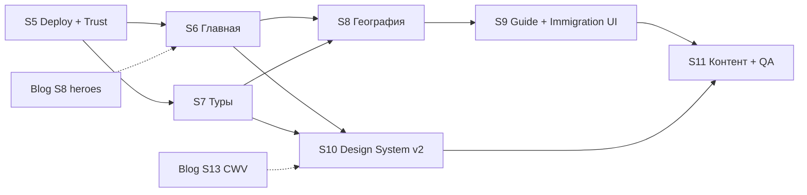

# AUDIT_REPORT — Фаза 2: визуальное превосходство

**Дата:** 21 июня 2026  
**Основа:** [AUDIT_REPORT.md](./AUDIT_REPORT.md) (стабилизация, спринты 1–4 ✓ в коде), [blog-ux-ui-roadmap.md](./blog-ux-ui-roadmap.md) (S7–S14), [audit-goargentina-etap-1.md](./audit/audit-goargentina-etap-1.md)  
**Цель фазы:** после выполнения спринтов 5–11 сайт выглядит **шикарно** — премиальная витрина, доверие, единый визуальный язык, без «демо-ощущения».

> **Нумерация:** спринты **5–11** продолжают стабилизацию **1–4**. Блоговые **S7–S14** — параллельная дорожная карта; пересечения отмечены явно.

---

## 1. Повторный аудит (post-stabilization)

### 1.1 Executive summary — текущее состояние

| Область | Было (до S1–4) | Сейчас (код) | До «шикарно» |
|---------|----------------|--------------|--------------|
| **Стабильность** | 🟡 nav 290 постов, search с noindex | 🟢 nav ≤12, search чистый, `/map` redirect | Deploy + smoke на prod |
| **UX** | 🟡 нет крошек, stub карты экскурсий | 🟢 PageBreadcrumbs, tag links, inline list | Карта, discovery, podbor polish |
| **UI каталога** | 🟡 logo в BlogCard, hotlinks tours | 🟢 ContentCard v2, manifest resolver, 0 hotlink pages | Deploy + visual QA |
| **Блог** | 🟡 design system частичный | 🟢 S7–S14 в roadmap (большинство ✓); heroes 100 % | Финальный visual QA на prod |
| **Доверие** | 🔴 фейки, Tripster без маркировки | 🟢 S5 trust gate в коде (рейтинги, stats, partner badge) | Deploy + prod smoke |
| **SEO / perf** | 🟡 meta дыры, нет Lighthouse CI | 🟢 metadata, JSON-LD, Lighthouse CI + phase2 script | Post-deploy Lighthouse lab |
| **Контент** | 🟡 67 indexable / 204 noindex | 🟢 N-01…N-04 в тестах; blog hero ≥95 % | Legal review immigration |

### 1.2 Автопроверки (21.06.2026, повтор)

```text
npm test                   → 195 pass (32 files), incl. sprint5–11 regression
npm run page-image-audit   → 0 hotlink pages; seed unsplash → manifest (S5)
npm run build              → OK (локально, 720 static pages)
Спринты 5–11               → ✅ deliverables в коде; ⏳ deploy + lab QA на prod
```

### 1.3 Что закрыто спринтами 1–4 (не повторять)

- Nav blog ≤12 indexable; site search без noindex черновиков  
- Card images через manifest/CMS resolver  
- PageBreadcrumbs на tour / excursion / destination / place / guide / expert  
- Blog tags → `/blog?tag=`, desktop search, tours `/tours`, `/experts` в nav  
- Metadata immigration/collections/contacts; JSON-LD absolute URLs  
- Lighthouse CI, bundle report, BlogRichArticle RSC split  
- `/about` — нормальная страница проекта (не design system)  
- `home.hero.*` — переводы в `ru.ts` / `es.ts`  
- Статические testimonials[] пусты → загрузка из DB/seed  

### 1.4 Главные пробелы до «шикарно»

#### A. Доверие и данные (блокирует premium-ощущение)

| ID | Проблема | Источник | Приоритет |
|----|----------|----------|-----------|
| T-01 | Рейтинг «4.9 · 187 отзывов» vs 3 реальных отзыва на странице тура | etap-1 | **P0** |
| D-03 | «Новый организатор» + «12 лет опыта / 680+ путешественников» | etap-1 | **P0** |
| D-04 | Счётчики 16 vs 5 туров; Tripster без маркировки; Бразилия в аргентинской выдаче | etap-1 | **P0** |
| N-01…N-04 | 275/280 Игуасу, 14/15 ВНЖ, 258/250 блог, цены тура | etap-1 | **P1** |
| I7-1 | Immigration/grazhdanstvo — устаревший судебный порядок (DNU 366/2025) | audit | **P0** (контент) |

#### B. Визуальная витрина — статус после S6–S11 (код)

| Область | В коде (S6–S11) | Остаётся manual |
|---------|-----------------|-----------------|
| **Главная** | 🟢 Hero collage, SectionShell, scroll-reveal, testimonials empty state | Lighthouse `/` ≥85, visual sign-off |
| **Каталог туров** | 🟢 ContentCard v2, sticky filters, partner badge | Lighthouse sample ≥85 |
| **Страница тура** | 🟢 Gallery carousel, itinerary timeline + mini-map, sticky booking | Visual QA gallery/booking |
| **Destinations / places** | 🟢 Full-bleed hero, 3-up gallery, transport map, related tours | — |
| **Карта** | 🟢 Legend, popup v2, mobile bottom sheet, tour deep-link | MapLibre bundle QA, sheet UX pass |
| **Guide / immigration** | 🟢 Editorial hub, Lucide icons, quick-30 на всех pillars | Legal review immigration |
| **Gallery / collections** | 🟢 Masonry + lightbox; collections card grid | E2E screenshot baseline |
| **Motion** | 🟢 `useRevealAnimation`, `prefers-reduced-motion` global | — |

#### C. Блог (S7–S14 — см. blog-ux-ui-roadmap)

| Метрика | Цель roadmap | Статус |
|---------|--------------|--------|
| Hero local (indexable) | ≥ 95 % | **49/49 (100 %)** |
| section-2/3 slots | ≥ 80 % long posts | ✓ для 25 постов |
| Lighthouse Perf mobile | ≥ 90 | CI есть, нужен post-deploy baseline |
| a11y | ≥ 95 | S14 deliverables ✓ в roadmap |

#### D. Производительность

- Client JS: **~12 MB** (484 chunks) — MapLibre в бюджете, но top chunks 600–770 KB  
- Organizer edit page 259 KB — не public surface  
- **Цель S10:** public routes median chunk **< 500 KB** first load  

---

## 2. Видение «шикарного» сайта

### 2.1 Принципы дизайна (фаза 2)

1. **Editorial travel magazine** — крупная типографика Unbounded/display, воздух, фото на весь блок, не «маркетплейс-таблица».  
2. **Один visual language** — карточки tour / excursion / blog / place из общей системы (`Card v2`: radius, shadow-card, hover lift, aspect-ratio).  
3. **Честность = premium** — пустое состояние отзывов красивее фейка; «Новый тур» как badge, не накрученный рейтинг.  
4. **Argentina as hero** — локальные manifest-кадры, никаких стоковых лиц в social proof.  
5. **Motion with restraint** — `animate-fade-in-up` + Intersection Observer; `prefers-reduced-motion` глобально.  
6. **Mobile-first glamour** — touch 44px, bottom sheets на карте, sticky CTA на туре.

### 2.2 Ключевые user journeys (must shine)

| Journey | Touchpoints | Критерий «шикарно» |
|---------|-------------|-------------------|
| Первый визит | `/` → `/tours` → `/tours/[slug]` | Wow hero, 3 клика до заявки, доверие с первого экрана |
| Планирование | `/podbor` → результаты → тур | Анимация результатов, embed туров в контексте |
| Исследование | `/blog/hub/patagonia` → rich post → tour embed | Hub как landing, reading layout без швов |
| География | `/mapa-argentina` → place → tour | Карта → карточка → бронирование без dead ends |
| Эмиграция | `/immigration` → pillar | Editorial hub, актуальные факты, не пугающий wall of text |

---

## 3. Спринты фазы 2 (5–11)

**Горизонт:** 7 спринтов × ~2 недели ≈ **14 недель**  
**Порядок:** S5 обязателен первым (deploy + trust). S6–S9 — параллелить по командам где возможно.



---

### Спринт 5 · Deploy, trust gate и единый источник данных

**Приоритет:** P0  
**Усилие:** M  
**Цель:** production актуален; пользователь не видит противоречий и фейков.

#### Scope

| Область | Файлы |
|---------|-------|
| Deploy | `production-launch-runbook.md`, Vercel, `sync-content-plan-redirects` |
| Analytics | GTM/GSC — `i2-analytics-gsc-runbook.md` |
| Reviews/stats | `tour-review-stats.ts`, `homepage-reviews.ts`, `PlatformStatsBlock`, `organizer-public.ts` |
| Tripster | `marketplace-tours.ts`, `homepage-tours.ts`, `TourCard` badges |
| Numbers | `content-audit` N-01…N-04, immigration grazhdanstvo |
| Media | `tour-details/*.ts`, `image-replacement-report.md` (64 unsplash) |

#### Deliverables

- [ ] Deploy спринтов 1–4 + production smoke 12/12 — см. [sprint5-deploy-checklist.md](./sprint5-deploy-checklist.md)
- [ ] `npm run sync-content-plan-redirects` на prod
- [ ] GTM container + GSC sitemap (manual checklist)
- [x] Рейтинг и count отзывов = `reviews.length` + real average; badge «Новый» без fake 187
- [x] PlatformStats: один источник (`getPlatformStatsFromRepository`) — только туры по Аргентине
- [x] Tripster: badge «Партнёр Tripster», фильтр country=AR на homepage, tooltip про переход
- [x] Unsplash batch 2: tour-details, checkout-addons, seed data → manifest (1 ref: `unsplash-client.ts`)
- [x] Immigration/grazhdanstvo: DNU 366/2025 (уже в `immigration-pillars`)
- [x] Единые числа: Игуасу ~275 (podbor), блог count из `computeBlogStats`  

#### Критерии приёмки

| Метрика | Цель |
|---------|------|
| Production smoke | **12/12** OK |
| Fake review count на public | **0** |
| Platform stats расхождение главная/about | **0** |
| Global unsplash refs | **0** |
| P0 trust issues etap-1 | **закрыты** |

---

### Спринт 6 · Главная — premium landing

**Приоритет:** P0  
**Усилие:** L  
**Цель:** первый экран вызывает «wow», не «ещё один каталог».

#### Scope

| Область | Файлы |
|---------|-------|
| Hero | `MarketplaceHome.tsx`, `SearchBlock.tsx`, `media-resolver` home slots |
| Sections | `TourGrid`, `PlatformStatsBlock`, `PersonalizedRecommendationsSection` |
| Regions | `POPULAR_DESTINATIONS`, showcase grid |
| Motion | `useScrollReveal` hook (reuse esim pattern), `globals.css` |
| Reviews | `TestimonialCard`, empty state component |

#### Deliverables

- [x] Hero v2: optional full-bleed background + gradient overlay ИЛИ asymmetric layout с 2–3 showcase images (manifest `home/showcase-*`)  
- [x] Региональная полоса: 4–6 destination cards с локальными cover, hover scale (reduced-motion safe)  
- [x] Секции: единый `SectionShell` (eyebrow + title + subtitle + optional CTA) — DRY для home/tours/about  
- [x] Stats block: visual upgrade — иконки, animate count-up optional  
- [x] Testimonials: если < 3 verified — красивый `EmptyState` «Первые отзывы скоро» вместо seed demo  
- [x] Scroll-reveal на 3–4 секциях ниже fold  
- [x] Mobile: hero image не обрезает ключевой объект; SearchBlock sticky optional  
- [ ] Lighthouse Performance `/` mobile ≥ 85, CLS hero < 0.1 — lab после deploy  
- [ ] Visual QA viewports 375 / 768 / 1280 / 1440; stakeholder sign-off hero  

#### Критерии приёмки

| Метрика | Цель |
|---------|------|
| Lighthouse Performance `/` mobile | **≥ 85** (lab) |
| CLS hero | **< 0.1** |
| Visual QA viewports | 375 / 768 / 1280 / 1440 |
| Stakeholder sign-off | hero mock approved |

#### Зависимости

- S5 deploy; blog S8 heroes для `BlogCard` на главной.

---

### Спринт 7 · Туры — каталог и детальная страница

**Приоритет:** P0  
**Усилие:** L  
**Цель:** карточка и страница тура уровня premium OTA, но с авторским характером.

#### Scope

| Область | Файлы |
|---------|-------|
| Catalog | `ToursCatalogView`, `FilterBar`, `MarketplaceTourCard` |
| Detail | `TourDetailView`, `ItinerarySection`, `TourGallery`, booking sidebar |
| Metadata | `tours/[slug]/page.tsx` — OG/Twitter (etap-1 P1) |
| PDF | `TourItineraryPdfButton` — domain goargentina.ru |
| Pricing | `tour-pricing.ts`, currency display |

#### Deliverables

- [x] `MarketplaceTourCard` v2: unified with blog card (aspect 4/3, badge stack, partner pill)  
- [x] Catalog: sticky filter bar on scroll; active filters as removable chips  
- [x] Tour detail: full-width gallery carousel (swipe, keyboard); thumbnail strip  
- [x] Itinerary: vertical timeline with day markers + inline mini-map per day (Leaflet lazy)  
- [x] Sticky booking card desktop; bottom bar mobile («от X ₽ · Заявка»)  
- [x] Metadata tour pages: description, canonical, OG image from cover  
- [x] PDF footer: production domain only  
- [x] Price consistency: single source → ₽/USD from same base (`tour-pricing.ts`)  
- [ ] Lighthouse tour sample Perf ≥ 85 mobile; visual QA gallery + itinerary + booking  

#### Критерии приёмки

| Метрика | Цель |
|---------|------|
| Tour pages with full metadata | **100 %** published |
| Price mismatch patagonia-glaciers | **0** |
| Visual QA tour detail | gallery + itinerary + booking |
| Lighthouse tour sample | Perf **≥ 85** mobile |

---

### Спринт 8 · География — destinations, places, карта

**Приоритет:** P1  
**Усилие:** L  
**Цель:** «увидеть Аргентину на карте» — flagship feature.

#### Scope

| Область | Файлы |
|---------|-------|
| Map hub | `mapa-argentina/page.tsx`, MapLibre components, `/api/map/objects` |
| Destinations | `DestinationView`, `destinations/[slug]` |
| Places | `PlaceDetailView`, `places-enrichment.ts` |
| Deep links | tour route polylines, `getTourRoutePoints` |

#### Deliverables

- [x] `/mapa-argentina`: layer toggles (туры / места / парки / транспорт); legend UI  
- [x] Marker popup v2: photo + title + 2 CTA (статья / тур)  
- [x] Mobile: bottom sheet popup вместо desktop popup  
- [x] Destination pages: full-bleed hero, `HubQuickFactsGrid` upgrade, photo mosaic 3-up  
- [x] Place pages: «Как добраться» block + inline Leaflet; related tours carousel  
- [x] Redirect `/map` → `/mapa-argentina` verified on prod (S1) + deprecate legacy UI  
- [x] Optional: «Показать на карте» link from tour detail  
- [ ] MapLibre bundle ≤ 450 KB; mobile map sheet QA pass  

#### Критерии приёмки

| Метрика | Цель |
|---------|------|
| MapLibre bundle budget | **≤ 450 KB** (keep) |
| Places with coordinates on map | **20/20** |
| Destination pages with hero + facts | **8/8** |
| Mobile map usable (sheet) | QA pass |

#### Зависимости

- S5 media; architecture: `argentina-interactive-map-architecture.md`.

---

### Спринт 9 · Guide, immigration, FAQ — editorial polish

**Приоритет:** P1  
**Усилие:** M  
**Цель:** контентные хабы выглядят как издание, не wiki.

#### Scope

| Область | Файлы |
|---------|-------|
| Guide | `GuideHubView`, `GuidePillarSection`, `GuidePillarCta` |
| Immigration | `ImmigrationHubView`, pillar pages |
| FAQ | `faq/page.tsx` |
| Contacts | `ContactsPageClient.tsx` |

#### Deliverables

- [x] Guide hub: hero band + category grid with icons (Lucide) — `GuideHubView`, `getGuideTopicIcon`  
- [ ] Guide hub: progress «прочитано» — optional, не реализован  
- [x] Pillar pages: sticky mini-TOC; «Кратко за 30 сек» заполнено на **всех** pillars (в т.ч. ekonomika-i-dengi)  
- [x] Immigration hub: visual parity with guide; warning callout для legal topics  
- [x] FAQ: accordion (`details`) вместо static dl; search within FAQ optional  
- [x] Contacts: map embed + team block; убрать skeleton flash  
- [x] Twitter/OG per-section fix (etap-1 meta class)  

#### Критерии приёмки

| Метрика | Цель |
|---------|------|
| Pillars with quick-facts block | **100 %** |
| Immigration pages updated 2026 | legal review ✓ |
| FAQ a11y accordion focus | WCAG spot-check |

---

### Спринт 10 · Design System v2 и performance trim

**Приоритет:** P1  
**Усилие:** M  
**Цель:** единая система компонентов + легче first load.

#### Scope

| Область | Файлы |
|---------|-------|
| Tokens | `tailwind.config`, `globals.css` |
| Cards | shared `ContentCard` or extend `ui/card` |
| Header/Footer | `Header.tsx`, `Footer.tsx` |
| Bundle | dynamic imports, `bundle-report.md` |
| Motion | global reduced-motion policy |

#### Deliverables

- [x] Design tokens v2: `--shadow-elevated`, `--radius-card`, spacing scale doc (1 page in code comments)
- [x] `ContentCard` primitive: image slot, badges, title, meta, overlay link — used by blog/tour/excursion
- [x] Header: subtle blur backdrop on scroll; footer newsletter visual upgrade
- [x] Code-split: MapLibre, PDF generator, organizer-only chunks — verify not in public layout
- [x] `prefers-reduced-motion` in `globals.css`: disable card hover scale, gallery autoplay
- [ ] Target: public route first JS **−15 %** vs baseline bundle report

#### Критерии приёмки

| Метрика | Цель |
|---------|------|
| Card components using shared primitive | **≥ 3** (blog, tour, excursion) |
| Public layout JS | **≤ 10 MB** total chunks |
| Lighthouse median public sample | Perf **≥ 90** |

---

### Спринт 11 · Контентная витрина, gallery, финальный QA

**Приоритет:** P1  
**Усилие:** M  
**Цель:** закрыть фазу 2 полным visual QA и контентным shine.

#### Scope

| Область | Файлы |
|---------|-------|
| Gallery | `/gallery` page |
| Blog index | final hero coverage |
| Collections | `/collections` visual upgrade |
| QA | Playwright visual smoke, Lighthouse full sample |
| Docs | update AUDIT_REPORT executive summary |

#### Deliverables

- [x] `/gallery`: masonry or justified grid, manifest-only images, lightbox  
- [x] Blog: довести hero coverage indexable до **≥ 95 %** (остаток S8) — audit 49/49  
- [x] Collections pages: cover + card grid parity with destinations  
- [x] E2E visual smoke: 10 URLs screenshot spec — `tests/e2e/visual-smoke.spec.ts` (baseline — после первого прогона)  
- [ ] Full Lighthouse lab run: 8 public URLs Perf ≥ 90 / A11y ≥ 95 — `npm run lighthouse:phase2` после deploy  
- [x] Content fact-check pass: N-01…N-04, tour copy — regression в `sprint11-qa.test.ts`  
- [x] Update `AUDIT_REPORT.md` — executive summary post-phase-2  
- [ ] Team visual sign-off — manual QA  

#### Критерии приёмки

| Метрика | Цель |
|---------|------|
| Indexable blog hero local | **≥ 95 %** |
| Lighthouse Performance median (8 URLs) | **≥ 90** |
| Lighthouse Accessibility median | **≥ 95** |
| etap-1 P0/P1 open items | **0** |
| Team visual sign-off | **pass** |

---

## 4. Параллельная дорожная карта блога (S7–S14)

Не дублировать в спринтах 5–11. Статус — [blog-ux-ui-roadmap.md](./blog-ux-ui-roadmap.md).

| Спринт | Фокус | Связь с фазой 2 |
|--------|-------|-----------------|
| S7 | TOC, typography | Уже ✓ — feeds reading on tour embeds |
| S8 | Heroes, card hierarchy | **Критично для S6** (blog block on home) |
| S9 | Section images, gallery | ✓ |
| S10 | Hub filters, catalog | ✓ |
| S11 | Typed blocks, parser tests | ✓ |
| S12 | Breadcrumbs, related | ✓ |
| S13 | CWV, Lighthouse | Align with **S10** bundle trim |
| S14 | a11y, mobile | Align with **S11** final QA |

**Рекомендация:** если ресурс один — сначала **S8 heroes**, затем **S6 home**; S13–S14 в финале вместе с **S10–S11**.

---

## 5. Чего не делаем в фазе 2

| Исключение | Причина |
|------------|---------|
| Полная оплата / escrow | Отдельная продуктовая дорожная карта |
| EN/es полный i18n | После RU visual stable |
| CMS visual page builder | `visual-page-builder-architecture.md` Phase 2+ |
| Переписывание 204 noindex статей | Контент-backlog, не блокер «шикарно» |
| Forum redesign | Низкий трафик |

---

## 6. Быстрые победы (между спринтами)

| # | Задача | Effort | Спринт |
|---|--------|--------|--------|
| QW1 | Partner badge на Tripster cards | 0.5 д | S5 |
| QW2 | Tour metadata template (OG/Twitter) | 1 д | S7 |
| QW3 | `SectionShell` component extract | 1 д | S6 |
| QW4 | Destination hero `priority` image | 0.5 д | S8 |
| QW5 | FAQ → accordion | 1 д | S9 |
| QW6 | Footer social links fill or hide | 0.5 д | S5 |
| QW7 | Gallery page MVP (12 photos) | 2 д | S11 |
| QW8 | Scroll-reveal hook shared | 1 д | S6 |

---

## 7. Метрики успеха фазы 2

| KPI | Baseline | Target |
|-----|----------|--------|
| Lighthouse Perf (median 8 public URLs) | ~? (post-deploy measure) | **≥ 90** |
| Lighthouse a11y | — | **≥ 95** |
| Global unsplash refs | 64 | **0** |
| Fake social proof instances | etap-1 count | **0** |
| Hotlink pages | 0 | **0** |
| Indexable blog hero local | ~90 % | **≥ 95 %** |
| User trust QA (manual 5 journeys) | — | **pass** |
| Visual stakeholder approval | — | **pass** |

---

## 8. Влияние изменений на проект

**Сущности:** `TourListing` badges (partner), unified `PlatformStats`, manifest slots home/showcase, `ContentCard` primitive.

**Страницы:** `/`, `/tours`, `/tours/[slug]`, `/mapa-argentina`, `/destinations/*`, `/places/*`, `/guide/*`, `/immigration/*`, `/gallery`.

**Кабинеты:** organizer tour editor — cover/gallery upload feeds manifest (already); partner badge read-only from import source.

**Будущее:** real payment → sticky booking card layout ready; Supabase reviews → testimonial block; CMS map fields Phase 2 map architecture.

---

## 9. Синхронизация проекта (после фазы 2)

| Изменение | Отображение | Редактирование |
|-----------|-------------|----------------|
| ContentCard v2 | home, catalog, blog, excursions | shared component |
| Partner badge | tour cards, detail | `marketplace-tours` import flag |
| Real review stats | cards, detail, home | DB reviews / seed cleanup |
| Home hero/showcase | `/` | manifest + CMS home settings |
| Map popups v2 | `/mapa-argentina` | places-seed + CMS coords |
| Tour gallery local | tour detail | manifest + organizer upload |
| Gallery page | `/gallery` | manifest curated set |

---

## 10. Следующий шаг

1. **Deploy** спринтов 1–11 на production — [sprint5-deploy-checklist.md](./sprint5-deploy-checklist.md).  
2. **Smoke:** `production-smoke` 12/12 + `test:e2e:smoke` + `lighthouse:phase2` на prod URL.  
3. **Manual:** GTM/GSC, visual sign-off (375/768/1280/1440), immigration legal review.  
4. **После S11 sign-off:** фаза 3 — monetization, EN locale, CMS page builder (optional).

---

*Документ создан по результатам повторного аудита 21.06.2026. Связан с [AUDIT_REPORT.md](./AUDIT_REPORT.md), [blog-ux-ui-roadmap.md](./blog-ux-ui-roadmap.md), [audit-goargentina-etap-1.md](./audit/audit-goargentina-etap-1.md).*
