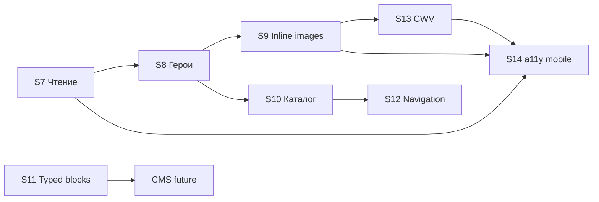

# Дорожная карта UX/UI блога «Пора в Аргентину»

> **Дата:** 21 июня 2026  
> **Основа:** [blog-quality-roadmap.md](./blog-quality-roadmap.md) (спринты S1–S6 ✓), [blog-content-ux-audit.md](./blog-content-ux-audit.md), [content-audit-report.md](./content-audit-report.md), [image-audit-report.md](./image-audit-report.md), [page-image-audit.md](./page-image-audit.md)  
> **Горизонт:** 8 спринтов × ~2 недели (~16 недель), **S7–S14**  
> **Фокус:** опыт чтения, визуальная иерархия, каталог и навигация — **без переписывания прозы**

---

## 1. Резюме

### Зрелость UX/UI (июнь 2026)

| Область | Состояние | Оценка |
|---------|-----------|--------|
| Design system секционных статей | `BlogCallout`, `BlogChecklist`, `BlogContentTable`, `BlogStepList`, `BlogFaqSection`, `BlogSectionBody` — единый язык с rich | **Высокая** |
| Парсинг тела секций | `parseBlogSectionBody` в `src/lib/blog-section-body.ts` — авто-разметка из `\n\n` | **Высокая** |
| Rich-вёрстка | `BlogRichArticle` + `BlogRichGalleryCarousel`, map/ticket-link, unified callout/table/FAQ | **Высокая** |
| Каталог и хабы | `BlogIndexView`, `BlogHubView`, `blog-hubs.ts` (4 хаба), фильтры, «Только вычитанные» | **Средняя** |
| Опыт чтения | `ContentReadingLayout`, TOC от 8 секций, sticky sidebar, scroll-spy, mobile TOC с текущей секцией | **Средняя–высокая** |
| Изображения | 73 локальных hero, 25 `section-1`, **25** `section-2`/`section-3`; rich gallery captions + attribution | **Средняя–высокая** |
| Навигация | «Читайте также» (`BlogRelatedPosts`), хлебные крошки + JSON-LD на post/hub, hub-aware related, «Из этого раздела» | **Средняя–высокая** |
| Производительность | `SafeImage`, Next/Image на карточках; LCP hero поста через `BlogPostHero` + preload; lazy section/gallery | **Средняя–высокая** |
| Доступность | FAQ `
`, callout `role="note"`, таблицы с scroll — без полного WCAG-аудита | **Средняя** |
| CMS-ready | Парсинг на лету + optional `blockType`/`blocks`; typed map/ticket/seasons/budget | **Средняя** |

**Каталог:** 276 материалов, **73 indexable**, 13 rich-гидов, **38 editorial overrides** (`blog-editorial/*.ts`).

### Главные пробелы (что делаем дальше)

1. **Визуальная иерархия статей** — S8 heroes + S9 section-2/3 закрыты для 25 длинных постов; остаётся довести hero для оставшихся indexable без локального кадра.
2. **Опыт длинного чтения** — scroll-spy и mobile TOC реализованы (S7); hero статьи только в шапке каталога, не в reading layout.
3. **Каталог и discovery** — хабы без фильтров внутри страницы; sidebar «Свежее» (`BlogSidebar`) не синхронизирован с hub-контекстом; related posts — только category/tags, без учёта hub и `relatedResources`.
4. **Инженерная устойчивость UI** — нет тестов парсера; typed-блоки rich (map, ticket) не переиспользуются в section-постах; `blockType` не заложен в модель данных.

---

## 2. Принципы спринтов S7–S14

- **Не повторяем S1–S6:** canonical, editorial overrides, hub-страницы, related posts, design system, fake views → dateModified уже сделаны.
- **Не трогаем:** полные переписывания текстов, оплату, CRM организатора, миграцию туров с Unsplash (вне блога — см. `image-replacement-report.md`).
- **Измеряем:** Lighthouse на sample-URL, покрытие hero/section-слотов, доля статей с typed-блоками, WCAG spot-check.
- **Связь с системой:** изменения в `BlogPostView` / `BlogIndexView` → проверить hub, sidebar, sitemap, OG-image resolver (`getBlogPostCoverImage`, `PageSlotImage`).

---

## 3. Спринты

### Спринт 7 · Опыт чтения: типографика, ритм, TOC

**Приоритет:** P0  
**Усилие:** M  
**Цель:** сделать длинные материалы (22 статьи с 8+ секциями) удобными для чтения на desktop и mobile — без правки контента.

#### Scope

| Область | Файлы / компоненты |
|---------|-------------------|
| Reading layout | `ContentReadingLayout.tsx`, `BlogPostView.tsx`, `globals.css` (`content-reading-prose--wide`) |
| TOC | `TableOfContents.tsx`, `hubTocStickyTopClass` |
| Section rhythm | `BlogPostSectionView.tsx`, spacing `space-y-10` |

#### Deliverables

- [x] Scroll-spy для sidebar TOC: `aria-current="location"` при пересечении секции (Intersection Observer на `headingId`).
- [x] Mobile TOC: sticky bar под hero или compact `
` с текущей секцией в summary.
- [x] Аудит типографики: `font-size ≥ 1rem`, `line-height 1.7`, max-width prose, контраст muted-текста — правки в `globals.css`.
- [x] Единый вертикальный ритм: `space-y-10` между секциями + согласованные отступы callout/table/FAQ (`BlogSectionBody`).
- [x] Lead-блок: excerpt в hero (`BlogPostView`) визуально отделён от первой секции (border или subtle background).
- [x] Rich-посты: тот же scroll-spy для `getBlogRichArticleToc`.
- [x] Документ sample-URL для QA (3 URL: section / rich / FAQ+table).

**Sample URL для QA (S7):**

| Тип | URL | Проверка |
|-----|-----|----------|
| Section (18 секций, TOC) | `/blog/patagonia-packing-list` | Scroll-spy sidebar (desktop) и sticky mobile TOC; ритм секций |
| Rich (13 секций, TOC) | `/blog/natsionalnyy-park-iguasu` | Scroll-spy по `section.id`; lede-блок rich |
| FAQ + таблица | `/blog/argentinian-steak-guide` | Парсер FAQ/таблицы; типографика списков |

#### Критерии приёмки

| Метрика | Цель |
|---------|------|
| Scroll-spy на TOC | Работает на 100 % постов с TOC (section ≥ 8 или rich ≥ 8) |
| Mobile TOC | Не перекрывает контент; keyboard-доступ к якорям |
| Spot-check QA | 3 эталонных URL без регрессий парсера |

#### Зависимости

- Design system S6 (готово).
- Нет блокеров по контенту.

---

### Спринт 8 · Герои и визуальная иерархия карточек

**Приоритет:** P0  
**Усилие:** L  
**Цель:** у каждого indexable editorial override и pillar — **свой** hero; карточки и OG не используют generic hub-fallback.

#### Scope

| Область | Файлы / данные |
|---------|----------------|
| Assets | `public/media/blog/{slug}/hero.jpg`, `scripts/stock-media-entities.mjs`, `page-registry` |
| Resolver | `getBlogPostCoverImage`, `getBlogPostCoverAlt` в `media-resolver.ts` |
| UI | `BlogCard.tsx`, `BlogPostView` hero band, hub `BlogHubView` |

#### Deliverables

- [x] **38 editorial slug** — локальный hero + manifest binding `blog:{slug}` (сейчас 34 папки hero, кириллические slug — алиасы или латинизированные пути в registry).
- [x] **11 pillar/secционных** без hero (из 49 indexable без `hero.jpg`) — приоритет: 8 `BLOG_START_HERE_SLUGS` + itinerary-3.
- [x] Legacy rich (Игуасу, Лос-Гласьяeres, Науэль-Уапи, Огненная Земля) — явная привязка `getRichArticleHeroImage` в карточках блога, не place-fallback.
- [x] `BlogPostView`: полноширинный hero-image под заголовком (optional `priority` для LCP) — `PageSlotImage` slot `hero` или `post.image`.
- [x] Подписи и alt на русском; attribution в footer hero для stock/Wikimedia.
- [x] Скрипт аудита: «indexable без локального hero» → CI warning.

#### Критерии приёмки

| Метрика | Цель |
|---------|------|
| Editorial overrides с локальным hero | **38 / 38** |
| Pillar + flagship с локальным hero | **100 %** 8 start-here + 5 flagship S3 |
| Indexable с hub-fallback hero | **≤ 5** (только новые до следующего fetch) |
| OG-image | Совпадает с hero карточки |

#### Зависимости

- `npm run fetch-stock-media` + ключи API (`.env.example`).
- S7 не блокирует, но hero band в `BlogPostView` логично после S7 layout.

---

### Спринт 9 · Инлайн-изображения: section-1/2/3 и rich-галереи ✓

**Приоритет:** P1  
**Усилие:** L  
**Статус:** ✓ выполнен 21.06.2026  
**Цель:** визуальные паузы в длинных статьях — три слота inline + polish галерей rich.

#### Scope

| Область | Компоненты |
|---------|------------|
| Section slots | `BlogPostSectionView` → `PageSlotImage` (`section-1`, `section-2`, `section-3`) |
| Manifest | `scripts/stock-media-entities.mjs`, `page-registry` |
| Rich | `BlogRichGalleryCarousel`, `getRichArticleGallery` |

#### Deliverables

- [x] Assets `section-2.jpg` / `section-3.jpg` для **25** indexable с `section-1` (≥ 6 секций — слоты section-2/3 только для длинных постов).
- [x] Manifest-записи для всех трёх слотов + `BLOG_SECTION_23_SLOTS` в `stock-media-entities.mjs`.
- [x] Graceful fallback: `hasContentSlotImage` + `PageSlotImage` → `null` без logo-fallback `<figure>`.
- [x] Rich gallery: caption + attribution footer; lightbox focus trap + Escape (`BlogRichGalleryCarousel`, `getRichArticleGallery`).
- [x] Duplicate Wikimedia `place:puerto-madryn` gallery-4 заменён (audit: 0 dup внутри place).
- [x] Lazy load: `loading="lazy"` для section-2/3; `priority` только section-1 на коротких постах (`< 6` секций).

#### Критерии приёмки

| Метрика | Цель |
|---------|------|
| Indexable ≥ 6 секций с ≥ 2 inline images | **≥ 80 %** |
| Rich gallery с caption | **13 / 13** |
| Пустых broken image slots | **0** |

#### Зависимости

- S8 hero pipeline (общий fetch-stock workflow).

---

### Спринт 10 · Каталог, хабы и карточки

**Приоритет:** P1  
**Усилие:** M  
**Цель:** блог как витрина — быстрый выбор темы, понятные карточки, hub как landing, а не просто список.

#### Scope

| Область | Файлы |
|---------|-------|
| Index | `BlogIndexView.tsx`, `BlogSearchFilters.tsx`, `BlogEditorialHubs.tsx`, `BlogTopicHubs.tsx` |
| Hub pages | `BlogHubView.tsx`, `blog-hubs.ts` |
| Cards | `BlogCard.tsx`, `BlogStartHere.tsx`, `BlogStatsOverview.tsx` |
| Sidebar | `BlogSidebar.tsx` («Свежее») |

#### Deliverables

- [x] Hub-страница: chip-фильтр по подкатегории / тегам внутри hub (client filter на `getBlogHubPosts`).
- [x] `BlogCard`: skeleton placeholder при lazy image; badge stack («Полный гид», «Вычитано») без наложения на mobile.
- [x] Featured logic: не более одной featured на экран; rich-pinned в hub col-span сохранить.
- [x] «Свежее» в sidebar: опция «из этого хаба» на hub- и post-страницах (`getBlogHubsForPost`).
- [x] Index: блок «По категориям» — quick jump pills с count (`getBlogCategoriesWithCounts`).
- [x] Empty state фильтров — иллюстрация + ссылка на hub «Путеводитель».
- [x] `BlogStartHere`: обновить превью-картинки после S8 heroes.

#### Критерии приёмки

| Метрика | Цель |
|---------|------|
| Hub с внутренним фильтром | **4 / 4** |
| Карточки с CLS при загрузке image | CLS **< 0.1** на index sample |
| Sidebar «Свежее» контекстный | На post view ≥ 1 материал из shared hub |

#### Зависимости

- S8 heroes для card visual quality.

---

### Спринт 11 · Интерактивные блоки и typed-контент

**Приоритет:** P1  
**Усилие:** M  
**Цель:** уменьшить хрупкость парсера; заложить CMS-ready typed blocks; расширить rich-widgets.

#### Scope

| Область | Файлы |
|---------|-------|
| Parser | `src/lib/blog-section-body.ts`, `BlogSectionBody.tsx` |
| Types | `src/types/blog-content-blocks.ts`, `src/types/cms-content.ts` |
| Rich | `BlogRichArticle.tsx`, `blog-articles/*.ts` |
| Tests | `src/lib/blog-section-body.test.ts` (новый) |

#### Deliverables

- [x] Vitest: ≥ 30 кейсов парсера (callout, checklist, table, FAQ, steps, subheading, edge `\n\n`).
- [x] Optional `blockType` на `BlogPostSection` (fallback → parser) — без ломки существующих 73 indexable.
- [x] Typed blocks в section-постах: `map`, `ticket-link` — reuse markup из rich (DRY component).
- [x] Season/budget widget как typed block в rich (пилот: `best-time-to-visit-argentina` data-only).
- [x] Расширить callout auto-detect: «Бюджет», «Сезон» → know/tip без ручных маркеров.
- [x] Документ «Как размечать статью» для редакторов (`docs/blog-markup-guide.md` — опционально, 1 стр.).

#### Критерии приёмки

| Метрика | Цель |
|---------|------|
| Parser test coverage | **≥ 30** cases, CI green |
| Regression на 73 indexable | **0** broken layouts |
| Rich с season/budget widget | **≥ 1** пилот |

#### Зависимости

- Design system S6.

---

### Спринт 12 · Навигация, discovery и перелинковка

**Приоритет:** P1  
**Усилие:** M  
**Цель:** читатель не упирается в тупик — hub, guide, places, related.

#### Scope

| Область | Файлы |
|---------|-------|
| Related | `blog-related-posts.ts`, `BlogRelatedPosts.tsx`, `mapBlogRelatedResources` |
| Breadcrumbs | `BlogPostView`, `BreadcrumbListJsonLd`, `blog-hubs.ts` |
| Sidebar links | `blog-hub-links.ts`, `BlogSidebar` |
| Knowledge graph | `knowledge-internal-links.ts`, `RelatedKnowledgeSection` (точечно) |

#### Deliverables

- [x] `BreadcrumbListJsonLd` на всех indexable post views (Главная → Блог → Hub? → Категория → Статья).
- [x] UI breadcrumbs: кликабельный hub (`getBlogHubsForPost`) если пост в hub.
- [x] `getRelatedBlogPosts`: +score за shared hub, `relatedResources` slug; −score за duplicate category без tags.
- [x] Блок «Из этого раздела» на hub-странице — anchor links на pinned slugs.
- [x] Post footer: compact links на guide/places из `relatedResources` (если не в sidebar).
- [x] Sitemap: hub priority ниже pillar, выше overrides (уточнение в `sitemap` config).

#### Критерии приёмки

| Метрика | Цель |
|---------|------|
| Indexable с BreadcrumbList JSON-LD | **100 %** |
| Related posts с hub-aware score | A/B spot-check: ≥ 2 из shared hub в top-4 |
| Post с ≥ 2 исходящими internal links | **100 %** indexable (уже content goal S6 — verify UI) |

#### Зависимости

- S10 hub UX.

---

### Спринт 13 · Производительность и Core Web Vitals

**Приоритет:** P0  
**Усилие:** M  
**Цель:** LCP и CLS блога в зелёной зоне на mobile sample.

#### Scope

| Область | Файлы |
|---------|-------|
| Images | `SafeImage`, `PageSlotImage`, `BlogCard`, `BlogPostView` |
| Carousel | `BlogRichGalleryCarousel` |
| CI | Lighthouse script / GitHub Action (sample URLs) |

#### Deliverables

- [x] LCP element: hero post / hub — `priority`, корректные `sizes` на `BlogCard` и post hero.
- [x] Preload OG hero только на post page (не index).
- [x] Gallery: первый слайд eager, остальные lazy; blur placeholder из manifest thumb (LQIP при наличии thumb).
- [x] Audit `next/image` unoptimized paths — 0 hotlinks в blog views (уже ✓ по page-image-audit).
- [x] Lighthouse CI на 5 URL: `/blog`, `/blog/hub/patagonia`, 2 section, 1 rich — mobile (`npm run lighthouse:blog`).
- [x] Budget: LCP **≤ 2.5 s**, CLS **≤ 0.1**, INP **≤ 200 ms** (lab) — проверка в скрипте.

#### Критерии приёмки

| Метрика | Цель |
|---------|------|
| Lighthouse Performance (mobile, sample) | **≥ 90** median |
| LCP on post pages | **≤ 2.5 s** lab |
| Blog routes with image hotlinks | **0** |

#### Зависимости

- S8–S9 image assets (иначе LCP fallback некачественный).

---

### Спринт 14 · Доступность и мобильная полировка

**Приоритет:** P1  
**Усилие:** M  
**Цель:** WCAG 2.1 AA spot-check на блог-компонентах; mobile-first polish.

#### Scope

| Область | Компоненты |
|---------|------------|
| a11y | `BlogCallout`, `BlogFaqSection`, `BlogContentTable`, `BlogRichGalleryCarousel`, `BlogSearchFilters` |
| Mobile | `BlogSidebar` collapse, `TableOfContents` mobile, touch targets |
| Contrast | callout variants в `BlogCallout.tsx`, `globals.css` |

#### Deliverables

- [x] axe / Lighthouse a11y на 5 sample URL — fix P0 (contrast, aria, focus order).
- [x] FAQ accordion: visible focus ring на `
` (уже частично — unify).
- [x] Carousel: `aria-live="polite"`, prev/next **≥ 44×44 px** touch targets.
- [x] Filters (`BlogSearchFilters`): label/id связка, announce results count (`aria-live`).
- [x] Mobile sidebar (`BlogSidebar`): не перекрывает reading width; swipe не ломает scroll.
- [x] Tables: hint «прокрутите таблицу →» на mobile при overflow.
- [x] `prefers-reduced-motion`: отключить gallery autoparallax / hover scale на `BlogCard`.

**Sample URL для QA (S14):**

| Тип | URL | Проверка |
|-----|-----|----------|
| Каталог + фильтры | `/blog` | aria-live счётчик, touch targets chips, label/id поиска |
| Rich + gallery | `/blog/natsionalnyy-park-iguasu` | carousel 44px, aria-live, reduced motion |
| FAQ + таблица | `/blog/argentinian-steak-guide` | FAQ focus ring, table scroll hint |
| Hub + sidebar | `/blog/hub/national-parks` | hub filters, sidebar collapse |
| Section + TOC | `/blog/patagonia-packing-list` | mobile TOC keyboard, focus rings |

#### Критерии приёмки

| Метрика | Цель |
|---------|------|
| Lighthouse Accessibility (sample) | **≥ 95** |
| axe critical violations on blog sample | **0** |
| Touch targets WCAG | **100 %** интерактивов блога ≥ 44px |

#### Зависимости

- S7 TOC mobile, S9 gallery, S10 filters.

---

## 4. Чего не делаем (out of scope)

| Исключение | Причина |
|------------|---------|
| Полные переписывания статей, расширение до 800 слов | Редакционный backlog, не UX/UI |
| Новые editorial overrides (wine, transport series) | Контент-спринты post-S6 P2 |
| Оплата, бронирование, CRM организатора | Другая дорожная карта |
| Миграция `/tours` Unsplash → manifest | `image-replacement-report.md`, не блог |
| Supabase CMS для блога | После стабилизации `blockType` (S11) |
| i18n EN/es | После RU UX stable |
| 301 кириллических slug | Когда появится трафик |

---

## 5. Быстрые победы (1–2 дня каждая)

| # | Задача | Effort | Эффект |
|---|--------|--------|--------|
| QW1 | Scroll-spy только для sidebar TOC (`TableOfContents`) | 1 д | Сразу лучше 22 длинных статьи |
| QW2 | `BreadcrumbListJsonLd` на `BlogPostView` по образцу `BlogHubView` | 0.5 д | SEO + навигация ✓ |
| QW3 | CI-скрипт «indexable без hero.jpg» | 0.5 д | Контроль S8 |
| QW4 | Hint overflow на `BlogContentTable` mobile | 0.5 д | a11y/UX таблиц (3 статьи) |
| QW5 | Hub chip «Только rich» на `/blog/hub/national-parks` | 1 д | Discovery нацпарков |
| QW6 | `prefers-reduced-motion` на hover scale `BlogCard` | 0.5 д | a11y |
| QW7 | Vitest smoke: 10 кейсов `parseBlogSectionBody` | 1 д | Защита парсера |
| QW8 | Related +10 score если shared hub (`blog-related-posts.ts`) | 0.5 д | Лучше «Читайте также» ✓ |

---

## 6. Backlog

| Элемент | Спринт | Приоритет |
|---------|--------|-----------|
| Scroll-spy TOC | S7 ✓ | P0 |
| Mobile sticky TOC | S7 ✓ | P0 |
| Typographic audit `content-reading-prose` | S7 ✓ | P0 |
| 38 editorial hero images | S8 | P0 |
| Post page hero band + LCP priority | S8 | P0 |
| Legacy rich hero в карточках | S8 | P1 |
| section-2 / section-3 assets (20+ posts) | S9 ✓ | P1 |
| Rich gallery captions + lightbox a11y | S9 ✓ | P1 |
| Hub internal filters | S10 | P1 |
| Contextual «Свежее» в sidebar | S10 | P1 |
| Category quick-jump on index | S10 | P2 |
| Vitest parser ≥ 30 cases | S11 | P1 |
| `blockType` optional field | S11 | P1 |
| map/ticket blocks in section posts | S11 | P2 |
| Season/budget rich widget | S11 | P2 |
| BreadcrumbList JSON-LD on posts | S12 ✓ | P1 |
| Hub-aware related posts | S12 ✓ | P1 |
| Lighthouse CI blog sample | S13 ✓ | P0 |
| Image sizes / priority audit | S13 ✓ | P0 |
| axe audit + contrast fixes | S14 ✓ | P1 |
| Carousel touch targets 44px | S14 ✓ | P1 |
| Filter aria-live | S14 ✓ | P2 |
| `docs/blog-markup-guide.md` | S11 | P2 |
| blockType CMS editor | post-S14 | P2 |
| Real analytics views | post-S14 | P2 |

---

## 7. Зависимости между спринтами

**Рекомендуемый порядок:** S7 → S8 → S9 ∥ S10 → S11 → S12 → S13 → S14.

---

## 8. Роли

| Роль | UX/UI артеfacts |
|------|-----------------|
| **Разработчик** | Components, parser tests, manifest, Lighthouse CI, a11y fixes |
| **Редактор** | Alt/caption тексты, выбор stock-кадров, markup guide |
| **Дизайн (лёгкий)** | Contrast tokens callout, card/hub layout review |

Факт-чек **не обязателен** для чисто UI-задач S7–S14, кроме подписей к изображениям (редактор).

---

## 9. Метрики прогресса (целевые)

| Спринт | Hero local (indexable) | section-2+ slots | Lighthouse Perf mobile | a11y score |
|--------|------------------------|------------------|------------------------|------------|
| S7 | — | — | — | — |
| S8 | **≥ 90 %** indexable | — | — | — |
| S9 | 90 %+ | **≥ 80 %** long posts | — | — |
| S10 | — | — | — | — |
| S11 | — | — | — | — |
| S12 | — | — | — | — |
| S13 | 95 %+ | 80 %+ | **≥ 90** | — |
| S14 | 95 %+ | 80 %+ | ≥ 90 | **≥ 95** |

---

## Влияние изменений на проект

- **Сущности:** optional `BlogPostSection.blockType`; manifest slots `blog:{slug}` × (hero, section-1…3).
- **Страницы:** `/blog`, `/blog/[slug]`, `/blog/hub/[hubId]` — primary UX surface.
- **Компоненты:** `BlogPostView`, `BlogIndexView`, `BlogHubView`, `BlogCard`, `ContentReadingLayout`, `TableOfContents`, blog design system.
- **Будущее:** CMS (`blockType`, typed blocks) → organizer/admin не в scope; Supabase после S11.

## Синхронизация проекта (после S7–S14)

| Изменение | Отображение | Редактирование |
|-----------|-------------|----------------|
| Hero / section slots | Card, post hero, OG | manifest, `fetch-stock-media` |
| TOC scroll-spy | Post + rich | `TableOfContents` |
| Hub filters | `/blog/hub/*` | `BlogHubView`, `blog-hubs.ts` |
| blockType | Section render | `blog.ts`, editorial TS, future CMS |
| Breadcrumb JSON-LD | Post metadata | `BlogPostView` |

---

*Документ продолжает [blog-quality-roadmap.md](./blog-quality-roadmap.md) (S1–S6 ✓) и [blog-content-ux-audit.md](./blog-content-ux-audit.md). Следующий пересмотр — после S10 или по итогам Lighthouse CI.*
