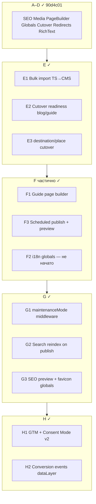
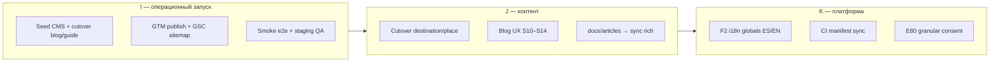

# Контрольная точка: фазы E–G + I–J (CMS cutover + аналитика)

**Дата:** 21 июня 2026 (обновлено после I1–J3)  
**Предыдущая точка:** `90d4c01` — фазы D1–D5 (cutover, redirects, rich-text, media pipeline)  
**Тесты:** vitest + `tsc --noEmit` OK · e2e smoke 11/11 на prod  
**Миграции:** 48+ файлов, включая `20250627000010_cms_scheduled_publish.sql`

---

## Сводка: I1–J3 выполнено

| Шаг | Статус | Команда / артефакт |
|-----|--------|-------------------|
| **I1** Seed + cutover blog/guide | ✓ 100% | `npm run supabase:seed-cms -- --type=blog,guide` |
| **I2** GTM / GSC tooling | ✓ скрипт | `npm run analytics-readiness`, `docs/i2-analytics-gsc-runbook.md` |
| **I2** Live GTM + verification | ⚠ вручную | Env в Vercel + redeploy |
| **I3** E2E smoke | ✓ | `PLAYWRIGHT_BASE_URL=… npm run test:e2e:smoke` (blog/guide/dest/place) |
| **J1** Cutover destination/place | ✓ 100% | `npm run cms:cutover-enable -- --destination-only --place-only --seed-first` |

**Все 4 CMS lane в режиме CMS-only:** blog, guide, destination, place.

### Новые ops-скрипты (после I/J)

| Скрипт | Назначение |
|--------|------------|
| `npm run cms:readiness` | Readiness 4 lane, `--strict` для CI/ops |
| `npm run sync-content-plan-redirects` | TS redirects → `url_redirects` в Supabase |
| `npm run cms:archive-orphan-blog-slugs` | Архив legacy slug в CMS (`buenos-aires-neighborhoods`, …) |
| `npm run register-cornerstone-media:check` | CI: hero + manifest для cornerstone |
| `npm run analytics-readiness` | I2: env + live GTM/robots/sitemap |

---

## Сводка реализованного



### E1 — Массовый импорт в CMS

| Артефакт | Назначение |
|----------|------------|
| `CmsBulkImportPanel` | UI: preview, выбор типов, rich HTML, i18n stubs |
| `POST/GET /api/admin/content/documents/bulk-import` | Импорт blog/guide/destination/place/legal из TS |
| `scripts/cms-cutover-enable.mjs` | CLI: seed + включение cutover по lane |
| `npm run cms:cutover-enable` | npm-скрипт |

### E2 / E3 — Cutover readiness

| Артефакт | Назначение |
|----------|------------|
| `cms-cutover.ts` | Readiness по 4 lane, `canEnable`, missing slugs |
| `CmsCutoverPanel` | Админка: coverage %, переключатели cutover |
| `destination-resolver.ts` / `place-resolver.ts` | CMS-only при `cmsDestinationCutover` / `cmsPlaceCutover` |
| `cmsDestinationCutover` / `cmsPlaceCutover` | Флаги в `site.features` |

### F1 — Page builder для guide

| Артефакт | Назначение |
|----------|------------|
| `GuideSectionPageBuilder` | Блоки guide в CMS-редакторе |
| `blockType` + `blocks` в `ContentSection` | Typed blocks |
| `ContentSectionBody` | Рендер через `renderBlogBodyBlock` |

### F3 — Scheduled publish / preview

| Артефакт | Назначение |
|----------|------------|
| `20250627000010_cms_scheduled_publish.sql` | Статус `scheduled`, `scheduled_publish_at` |
| `POST/DELETE …/schedule` | API планирования |
| `/api/cron/cms/publish-scheduled` | Cron в `platform-maintenance` |
| `CmsPreviewBanner` + `?live=1` | Live preview через sessionStorage |
| `CmsDocumentPreviewContent` | Preview всех 5 типов документов |

### G — Эксплуатация

| Задача | Статус |
|--------|--------|
| `maintenanceMode` в middleware → `/maintenance` | ✓ |
| `cms-search-sync.ts` — reindex при publish/archive | ✓ |
| `CmsOpsPanel` — reindex, manifest, scheduled count | ✓ |
| `SiteGlobalsSeoPreview` — snippet в Settings | ✓ |
| Favicon / apple-touch из `site.branding` | ✓ |

### H — Веб-аналитика (GTM)

| Артефакт | Назначение |
|----------|------------|
| `GtmHeadScripts` + `SiteGtmLoader` | GTM + Consent Mode v2 |
| `gtm-events.ts` | 9 событий dataLayer |
| `MessengerClickTracker` | WhatsApp / Telegram sitewide |
| Meta verification GSC / Bing / Ahrefs | env + Admin SEO globals |
| `docs/analytics-gtm-setup.md` | Инструкция настройки тегов в GTM |

---

## Пробелы и недоработки

### P0 — блокирует prod cutover

| # | Пробел | Риск | Действие |
|---|--------|------|----------|
| P0-1 | ~~Cutover флаги не включены~~ | — | ✓ I1/J1: все 4 lane включены |
| P0-2 | **GTM container не опубликован** | Аналитика не работает | Env в Vercel + теги по `analytics-gtm-setup.md` |
| P0-3 | **Миграция F3 на staging/prod** | scheduled publish упадёт | `npm run supabase:migrate` на каждом окружении |

### P1 — качество и эксплуатация

| # | Пробел | Статус |
|---|--------|--------|
| P1-1 | **F2 i18n globals ES/EN** | Не реализовано (план E77) |
| P1-2 | **CI: `sync-cms-media-manifest`** | Нет шага (нужен Supabase env в CI) |
| P1-3 | ~~E2E smoke после cutover~~ | ✓ I3: расширен `smoke.spec.ts` |
| P1-4 | ~~Bulk import на prod~~ | ✓ seed + readiness 100% |
| P1-5 | ~~Redirects для изменившихся slug~~ | ✓ `sync-content-plan-redirects` + static map |
| P1-6 | **Верификация GSC/Bing/Ahrefs** | Meta в коде; токены — Vercel env + GSC sitemap |

### P2 — улучшения (не блокируют)

| # | Пробел | Комментарий |
|---|--------|-------------|
| P2-1 | Единый `CmsPageBuilder` для blog+guide | F1 покрывает guide; blog уже на page builder |
| P2-2 | Lexical editor | Отложено; `RichTextEditor` достаточен |
| P2-3 | GTM export JSON в репо | Только документация; теги в UI GTM |
| P2-4 | `docs/articles/` reorganize | Частично; старые `docs/*.md` удалены локально |
| P2-5 | Контент S10–S14 (blog UX roadmap) | Отдельный контентный поток |
| P2-6 | Meilisearch reindex | Работает через API; Meilisearch опционален |
| P2-7 | Granular cookie consent для personalization vs analytics в GTM | Сейчас analytics_storage = analytics category |
| P2-8 | ~~speakable JSON-LD~~ | ✓ `buildArticleSchema` + `data-speakable` на постах |
| P2-9 | Valdes rich MD stub | Полная статья в TS; sync после расширения MD |

### Технический долг

- `hasInteractionTrackingConsent()` всё ещё привязан к общему `hasCookieConsentDecision()` — E80 stub
- Preview globals (`?live=1`) — sessionStorage, не shareable URL для редакторов
- Scheduled publish cron зависит от `CRON_SECRET` / Vercel cron в `vercel.json`

---

## Синхронизация проекта

| Сущность | Публично | Админка / ops |
|----------|----------|---------------|
| `scheduled` status | — | Editor → планирование; cron публикует |
| Guide `blockType` | `/guide/*` sections | GuideSectionPageBuilder |
| Cutover flags ×4 | Resolvers, sitemap | Settings + CmsCutoverPanel |
| GTM events | dataLayer после consent | — |
| SEO verification meta | `<head>` | Settings → SEO |
| `cms-search-sync` | Поиск актуален | CmsOpsPanel → reindex |

---

## Дальнейший план (фаза I+)



### Рекомендуемый порядок (оставшееся)

1. **I2 (ручное)** — GTM env в Vercel → redeploy → GSC sitemap → [`docs/i2-analytics-gsc-runbook.md`](./i2-analytics-gsc-runbook.md)
2. **`npm run sync-content-plan-redirects`** — один раз на staging/prod после деплоя
3. **`npm run cms:archive-orphan-blog-slugs`** — архив legacy slug в CMS
4. **K1** — F2 i18n globals (3+ спринта, E77)

---

## Команды контрольной точки

```bash
npm run cms:readiness -- --strict
npm run sync-content-plan-redirects:check
npm run register-cornerstone-media:check
npm test
npx tsc --noEmit
PLAYWRIGHT_BASE_URL=https://www.goargentina.ru npm run test:e2e:smoke
```

---

*Дополняет [cms-checkpoint после D5](.) и [analytics-setup-report.md](./analytics-setup-report.md).*
