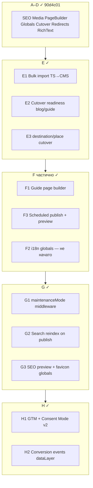
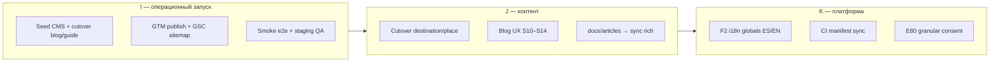

# Контрольная точка: фазы E–G + веб-аналитика (GTM)

**Дата:** 21 июня 2026  
**Предыдущая точка:** `90d4c01` — фазы D1–D5 (cutover, redirects, rich-text, media pipeline)  
**Тесты на момент точки:** 107/107 pass · `tsc --noEmit` OK  
**Миграции:** 48 файлов, включая `20250627000010_cms_scheduled_publish.sql`

---

## Сводка реализованного



### E1 — Массовый импорт в CMS

| Артефакт | Назначение |
|----------|------------|
| `CmsBulkImportPanel` | UI: preview, выбор типов, rich HTML, i18n stubs |
| `POST/GET /api/admin/content/documents/bulk-import` | Импорт blog/guide/destination/place/legal из TS |
| `scripts/cms-cutover-enable.mjs` | CLI: seed + включение cutover по lane |
| `npm run cms:cutover-enable` | npm-скрипт |

### E2 / E3 — Cutover readiness

| Артефакт | Назначение |
|----------|------------|
| `cms-cutover.ts` | Readiness по 4 lane, `canEnable`, missing slugs |
| `CmsCutoverPanel` | Админка: coverage %, переключатели cutover |
| `destination-resolver.ts` / `place-resolver.ts` | CMS-only при `cmsDestinationCutover` / `cmsPlaceCutover` |
| `cmsDestinationCutover` / `cmsPlaceCutover` | Флаги в `site.features` |

### F1 — Page builder для guide

| Артефакт | Назначение |
|----------|------------|
| `GuideSectionPageBuilder` | Блоки guide в CMS-редакторе |
| `blockType` + `blocks` в `ContentSection` | Typed blocks |
| `ContentSectionBody` | Рендер через `renderBlogBodyBlock` |

### F3 — Scheduled publish / preview

| Артефакт | Назначение |
|----------|------------|
| `20250627000010_cms_scheduled_publish.sql` | Статус `scheduled`, `scheduled_publish_at` |
| `POST/DELETE …/schedule` | API планирования |
| `/api/cron/cms/publish-scheduled` | Cron в `platform-maintenance` |
| `CmsPreviewBanner` + `?live=1` | Live preview через sessionStorage |
| `CmsDocumentPreviewContent` | Preview всех 5 типов документов |

### G — Эксплуатация

| Задача | Статус |
|--------|--------|
| `maintenanceMode` в middleware → `/maintenance` | ✓ |
| `cms-search-sync.ts` — reindex при publish/archive | ✓ |
| `CmsOpsPanel` — reindex, manifest, scheduled count | ✓ |
| `SiteGlobalsSeoPreview` — snippet в Settings | ✓ |
| Favicon / apple-touch из `site.branding` | ✓ |

### H — Веб-аналитика (GTM)

| Артефакт | Назначение |
|----------|------------|
| `GtmHeadScripts` + `SiteGtmLoader` | GTM + Consent Mode v2 |
| `gtm-events.ts` | 9 событий dataLayer |
| `MessengerClickTracker` | WhatsApp / Telegram sitewide |
| Meta verification GSC / Bing / Ahrefs | env + Admin SEO globals |
| `docs/analytics-gtm-setup.md` | Инструкция настройки тегов в GTM |

---

## Пробелы и недоработки

### P0 — блокирует prod cutover

| # | Пробел | Риск | Действие |
|---|--------|------|----------|
| P0-1 | **Cutover флаги не включены** | TS и CMS дублируют контент | E2 smoke → `npm run cms:cutover-enable -- --seed-first` |
| P0-2 | **GTM container не опубликован** | Аналитика не работает | Заполнить env, настроить теги по `analytics-gtm-setup.md` |
| P0-3 | **Миграция F3 на staging/prod** | scheduled publish упадёт | `npm run supabase:migrate` на каждом окружении |

### P1 — качество и эксплуатация

| # | Пробел | Статус |
|---|--------|--------|
| P1-1 | **F2 i18n globals ES/EN** | Не реализовано (план E77) |
| P1-2 | **CI: `sync-cms-media-manifest`** | Нет шага в `.github/workflows/ci.yml` |
| P1-3 | **E2E smoke после cutover** | `test:e2e:smoke` не прогонялся в этой ветке |
| P1-4 | **Bulk import на prod** | Нужен ручной прогон + проверка readiness panel |
| P1-5 | **Redirects для изменившихся slug** | После cutover — сверка с `url_redirects` |
| P1-6 | **Верификация GSC/Bing/Ahrefs** | Meta в коде; токены и sitemap — вручную |

### P2 — улучшения (не блокируют)

| # | Пробел | Комментарий |
|---|--------|-------------|
| P2-1 | Единый `CmsPageBuilder` для blog+guide | F1 покрывает guide; blog уже на page builder |
| P2-2 | Lexical editor | Отложено; `RichTextEditor` достаточен |
| P2-3 | GTM export JSON в репо | Только документация; теги в UI GTM |
| P2-4 | `docs/articles/` reorganize | Частично; старые `docs/*.md` удалены локально |
| P2-5 | Контент S10–S14 (blog UX roadmap) | Отдельный контентный поток |
| P2-6 | Meilisearch reindex | Работает через API; Meilisearch опционален |
| P2-7 | Granular cookie consent для personalization vs analytics в GTM | Сейчас analytics_storage = analytics category |

### Технический долг

- `hasInteractionTrackingConsent()` всё ещё привязан к общему `hasCookieConsentDecision()` — E80 stub
- Preview globals (`?live=1`) — sessionStorage, не shareable URL для редакторов
- Scheduled publish cron зависит от `CRON_SECRET` / Vercel cron в `vercel.json`

---

## Синхронизация проекта

| Сущность | Публично | Админка / ops |
|----------|----------|---------------|
| `scheduled` status | — | Editor → планирование; cron публикует |
| Guide `blockType` | `/guide/*` sections | GuideSectionPageBuilder |
| Cutover flags ×4 | Resolvers, sitemap | Settings + CmsCutoverPanel |
| GTM events | dataLayer после consent | — |
| SEO verification meta | `<head>` | Settings → SEO |
| `cms-search-sync` | Поиск актуален | CmsOpsPanel → reindex |

---

## Дальнейший план (фаза I+)



### Рекомендуемый порядок

1. **I1** — `supabase:seed-cms` → readiness 100% → cutover blog/guide на staging
2. **I2** — env GTM + верификация поисковиков + sitemap в GSC
3. **I3** — `PLAYWRIGHT_BASE_URL=… npm run test:e2e:smoke`
4. **J1** — cutover destination/place после импорта
5. **K1** — F2 i18n globals (3+ спринта, E77)

---

## Команды контрольной точки

```bash
npm run supabase:migrate    # ✓ применено локально
npm test                    # 107 pass
npx tsc --noEmit            # OK
git commit …                # этот коммит
git push origin main
```

---

*Дополняет [cms-checkpoint после D5](.) и [analytics-setup-report.md](./analytics-setup-report.md).*
