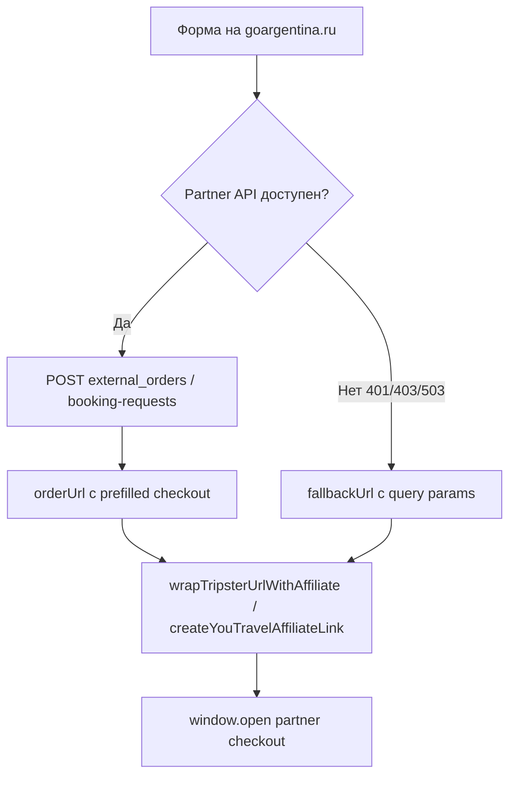

# Партнёрские интеграции — справочник для разработчиков и AI-агентов

Краткие, проверенные по официальной документации и коду репозитория заметки по каждому партнёру.  
**Перед изменениями кода интеграций** читайте соответствующий файл и раздел «Что ломает prefilling / checkout».

| Партнёр | Файл | Назначение в проекте |
|---------|------|----------------------|
| **Tripster** | [tripster.md](./tripster.md) | Экскурсии и партнёрские туры, External Orders API, prefilling checkout |
| **Travelpayouts** | [travelpayouts.md](./travelpayouts.md) | Партнёрские ссылки (Tripster, YouTravel, Sputnik8), whitelabel авиа/страхование |
| **YouTravel.me** | [youtravel.md](./youtravel.md) | Партнёрские туры, booking API, Affise-статистика |
| **Sputnik8** | [sputnik8.md](./sputnik8.md) | Экскурсии (affiliate-only в текущем UX) |

Дополнительно в коде (без отдельного справочника): **Intui** (трансферы), **Airalo** (eSIM), **WeGoTrip** — только affiliate/deep-link, без native booking.

## Общая схема бронирования партнёра



## Ключевые env-переменные

См. `.env.example`. Минимум для Tripster + affiliate:

- `TRIPSTER_PARTNER`, `TRIPSTER_SECRET`, `TRIPSTER_API_BASE`
- `TRAVELPAYOUTS_API_KEY`, `TRAVELPAYOUTS_MARKER`, `TRAVELPAYOUTS_TRS`

## Связанные epic-документы

- `docs/tripster-booking-e99.md` — E99 native booking flow в ЛК
- `docs/youtravel-integration-sprints.md` — план интеграции YouTravel

## Проверка окружения

```bash
node scripts/tripster-verify.mjs
node scripts/youtravel-verify.mjs
```
