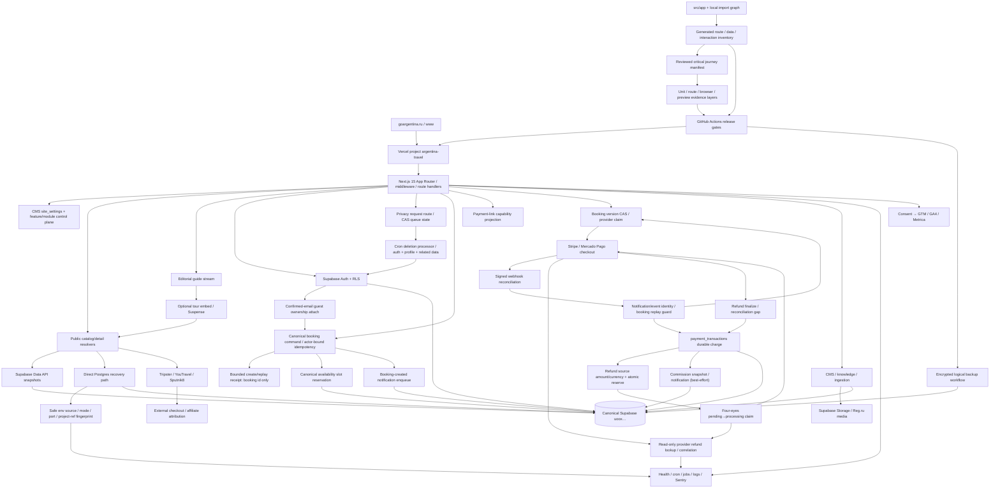

# DEPENDENCY_GRAPH

Обновлён по repository + production/candidate evidence 2026-07-29.

## Critical user flow

`browser → page/RSC → resolver → snapshot/partner → typed mapper → catalog/detail → capability-driven CTA → partner outbound or internal persisted request`.

Current production boundary is broken: Supabase REST and deployed direct PG are unavailable. Candidate WP-001 preserves this as `unavailable` and does not alter checkout URLs or create external orders. Candidate WP-002 makes the next action and seller boundary explicit in public copy.

## Release dependency chain

`frozen source SHA → npm ci → type/lint/unit/contracts → build → migration dry-run/parity → preview deployment ID → browser/e2e/smoke → promote same artifact → production SHA/ID → health/catalog/detail/analytics evidence`.

Current breaks: WP-016 exact candidate `2fccb050` safely exposes the selected Postgres source/mode/port/project ref and is locally build/runtime-proven, but Vercel returns `Account is blocked` and has created no deployment; CLI scope is `Not authorized`. Canonical production remains on unhealthy `993e82fb`, so deployed connection identity, migration parity and runtime logs remain unavailable. WP-015B also remains behind atomic recovery ownership evidence.

## Data ownership boundaries

- GoArgentina production database is canonical ref `uooxrypocahomoqzdvzy`; other accessible Supabase projects are not evidence.
- Public health may expose only a bounded Postgres connection fingerprint (supported env source name, connection mode, effective port and Supabase project ref). It must never expose URL, hostname, username, password or query parameters.
- Partner APIs own partner booking/payment; GoArgentina owns disclosure, attribution and safe redirect.
- Internal requests require persisted state, notifications, SLA and admin ownership before public promise.
- No B2B product may share production DB/secrets/releases without ADR.
- Current source topology is recorded in `docs/audit/architecture-current.md`; its data/access candidates remain static evidence until live Supabase and effect tests confirm them.
- Critical action topology is recorded in `docs/audit/critical-interaction-evidence.csv`; `contract_tested` means only the listed unit contract, while route/browser/preview/live gaps remain explicit.
- Privacy approval owns only the CAS queue transition; the cron processor owns irreversible deletion/anonymization. WP-008 preserves retry identity; WP-009 makes terminal writes monotonic and isolates notification failure. Candidate evidence still does not prove live cron completion, unique active requests, leases/checkpoints or transactional audit.
- A payment-link token owns only the bounded checkout/status view. The first online provider is claimed on the booking row before external checkout creation; signed provider webhooks remain the only authority for captured payment state.
- A webhook notification/event ID owns booking-state idempotency; the provider payment resource ID owns charge-ledger uniqueness. Exact event replay may repair a missing charge row, but may not repeat a booking transition or duplicate notification for an existing row.
- A successful webhook response proves only durable charge persistence. Commission snapshot and customer notification remain separate best-effort effects until an idempotent outbox/reconciliation path is live-proven.
- A native booking request owns only canonical server-derived commercial fields. Quote intent never owns inventory; a scheduled booking must confirm its canonical availability slot before the atomic persistence command. Notification enqueue follows only a newly created booking, not an idempotent replay.
- A booking idempotency key identifies an operation, not a bearer CRM capability. The stored actor must match the new canonical actor; an authenticated same-email retry may first claim a guest row only through the confirmed-email attach RPC. Public create and replay responses contain only the deterministic booking ID, never the stored CRM row.
- A refund request never owns money supplied by the browser or booking USD presentation. The completed charge owns provider, amount and currency; the atomic RPC owns replay, source lock and cumulative reservation. A different personal finance actor owns execution claim. Provider lookup is read-only evidence: exact Stripe metadata/source/money correlation can diagnose but still cannot authorize mutation; Mercado Pago amount-only correlation is only a candidate. Provider-uncertain `processing` has no proven recovery lease and remains an explicit gap.
