# DEPENDENCY_GRAPH

Обновлён по repository + production/candidate evidence 2026-07-29.

```mermaid
flowchart TD
  DNS["goargentina.ru / www"] --> Vercel["Vercel project argentina-travel"]
  Vercel --> Next["Next.js 15 App Router / middleware / route handlers"]
  Next --> Control["CMS site_settings + feature/module control plane"]
  Next --> Resolver["Public catalog/detail resolvers"]
  Resolver --> DetailFanout["Catalog detail fan-out / href-bound offer evidence"]
  DetailFanout --> DetailGuard["WP-021 FIFO resolver limit=3 + in-flight slug dedupe"]
  Next --> Guide["Editorial guide stream"]
  Guide --> Optional["Optional tour embed / Suspense"]
  Optional --> Resolver
  Next --> Blog["Editorial blog RSC stream"]
  Blog --> BlogOptional["Optional tour catalog / fail-soft boundary"]
  BlogOptional --> CandidatePick["WP-023 renderable widget/geography candidates first"]
  CandidatePick --> Resolver
  Next --> Auth["Supabase Auth + RLS"]
  Next --> Privacy["Privacy request route / CAS queue state"]
  Next --> BookingCreate["Canonical booking command / actor-bound idempotency"]
  BookingCreate --> BookingReceipt["Bounded create/replay receipt: booking id only"]
  Auth --> GuestAttach["Confirmed-email guest ownership attach"]
  GuestAttach --> BookingCreate
  BookingCreate --> Availability["Canonical availability slot reservation"]
  BookingCreate --> Notify["Booking-created notification enqueue"]
  Availability --> Supabase
  Notify --> Supabase
  Next --> PaymentStatus["Payment-link capability projection"]
  Next --> PaymentClaim["Booking version CAS / provider claim"]
  PaymentClaim --> PayProviders["Stripe / Mercado Pago checkout"]
  PayProviders --> PayWebhook["Signed webhook reconciliation"]
  PayWebhook --> EventIdentity["Notification/event identity / booking replay guard"]
  EventIdentity --> PaymentClaim
  EventIdentity --> ChargeLedger["payment_transactions durable charge"]
  ChargeLedger --> RefundPrepare["Refund source amount/currency + atomic reserve"]
  RefundPrepare --> RefundClaim["Four-eyes pending→processing claim"]
  RefundClaim --> PayProviders
  PayProviders --> RefundLookup["Read-only provider refund lookup / correlation"]
  RefundClaim --> RefundLookup
  RefundLookup --> Ops
  PayProviders --> RefundFinalize["Refund finalize / reconciliation gap"]
  RefundFinalize --> ChargeLedger
  ChargeLedger --> Commission["Commission snapshot / notification (best-effort)"]
  ChargeLedger --> Supabase
  Commission --> Supabase
  Privacy --> Processor["Cron deletion processor / auth + profile + related data"]
  Processor --> Auth
  Next --> CMS["CMS / knowledge / ingestion"]
  Next --> Comments["Public article comments"]
  Resolver --> RestCircuit["WP-022 quota-only catalog REST circuit: cold/open/half-open"]
  RestCircuit --> Rest["Supabase Data API catalog snapshots"]
  CMS --> CMSRest["Public CMS Data API/fallback path"]
  CMSRest --> CMSTruth["WP-024 typed available/unavailable/missing + fallback outside cache"]
  Comments --> CMSTruth
  CMSTruth --> Rest
  Resolver --> PGResolve["Postgres candidate resolver"]
  TrustedRef["Trusted NEXT_PUBLIC_SUPABASE_URL ref"] --> PGAttest["Canonical project-ref attestation"]
  PGResolve --> PGAttest
  AuthSession["Auth session revocation"] --> PGAttest
  RLSAudit["RLS audit"] --> PGAttest
  PrismaGate["Prisma DB feature gate"] --> PGAttest
  OpsPG["Operational PG tooling: backup / restore / migration / sync / maintenance"] --> OpsAttest["Explicit trusted ref + target attestation"]
  OpsAttest --> PGAttest
  LegacyRunner["Legacy unjournaled admin migration runner"] --> FailClosed
  PGAttest -->|verified only| PG["Direct Postgres recovery path"]
  PGAttest -->|unverified / mismatch| FailClosed["No connection / readiness fail"]
  PG --> PGFingerprint["Safe env source / mode / port / project-ref / target status"]
  PGFingerprint --> Ops
  Resolver --> Partners["Tripster / YouTravel / Sputnik8"]
  Partners --> PartnerLog["WP-026 pending: bounded provider logging"]
  DetailFanout --> Partners
  DetailGuard --> PGPool["Shared attested partner PG pool max=2 / 8s deadlines"]
  PGPool --> PG
  Partners --> Affiliate["External checkout / affiliate attribution"]
  CMS --> Storage["Supabase Storage / Reg.ru media"]
  Next --> Ops["Health / cron / jobs / logs / Sentry"]
  Next --> Analytics["Consent → GTM / GA4 / Metrica"]
  GitHub["GitHub Actions release gates"] --> Vercel
  Source["src/app + local import graph"] --> Inventory["Generated route / data / interaction inventory"]
  Inventory --> Critical["Reviewed critical journey manifest"]
  Critical --> Contracts["Unit / route / browser / preview evidence layers"]
  Inventory --> GitHub
  Contracts --> GitHub
  GitHub --> Backup["Encrypted logical backup workflow"]
  Backup --> Supabase[("Canonical Supabase uoox…")]
  Rest --> Supabase
  PG --> Supabase
  Auth --> Supabase
  CMS --> Supabase
```

## Critical user flow

`browser → page/RSC → resolver → snapshot/partner → typed mapper → catalog/detail → capability-driven CTA → partner outbound or internal persisted request`.

Current production boundary is broken: Supabase REST and deployed direct PG are unavailable. Candidate WP-001 preserves this as `unavailable` and does not alter checkout URLs or create external orders. Candidate WP-002 makes the next action and seller boundary explicit in public copy.

## Release dependency chain

`frozen source SHA → npm ci → type/lint/unit/contracts → build → migration dry-run/parity → preview deployment ID → browser/e2e/smoke → promote same artifact → production SHA/ID → health/catalog/detail/analytics evidence`.

Current breaks: WP-018 exact `8f0dbad2` / `E288Fh…` proves application target attestation. WP-019 exact `a3301ec9` / `E17wLXY…` extends the invariant to operational tooling and disables the unjournaled runner. WP-020 exact `ed29b335` / `3hwMwixf…` closes asset/error-route false commercial evidence. WP-021 `d6808a5c` / `BMXQzS…` bounds per-instance catalog/direct-PG pressure. WP-022 `4aa7f52c` / `GWXM4c…` bounds public catalog REST quota amplification. WP-023 `e22b5885` / `5HameB…` selects renderable candidates before strict detail validation. WP-024 exact `d4fbbbc1` / `9nLoBa…` preserves CMS/comments truth and prevents degraded-cache/false-404 behavior. REST and preview direct PG are still unavailable, production runs old `993e82fb`, and raw Tripster provider logging is registered as WP-026; migration parity, backup effect, distributed recovery and same-artifact production proof remain unavailable.

## Data ownership boundaries

- GoArgentina production database is canonical ref `uooxrypocahomoqzdvzy`; other accessible Supabase projects are not evidence.
- Public health may expose only a bounded Postgres connection fingerprint (supported env source name, connection mode, effective port, Supabase project ref and attestation status). It must never expose URL, hostname, username, password or query parameters.
- Direct Postgres access is owned by canonical project attestation: only official Supabase direct/pooler formats whose ref equals an independent trusted project ref may connect. Higher-precedence unknown/mismatch values are skipped; absence of any verified target fails closed. Runtime, session revocation, RLS audit, Prisma gating, backup/restore, migration, partner sync and maintenance tooling share this rule. Cross-project copy requires two distinct refs and explicit production confirmation; the legacy unjournaled runner is disabled.
- Partner APIs own partner booking/payment; GoArgentina owns disclosure, attribution and safe redirect.
- Internal requests require persisted state, notifications, SLA and admin ownership before public promise.
- No B2B product may share production DB/secrets/releases without ADR.
- Current source topology is recorded in `docs/audit/architecture-current.md`; its data/access candidates remain static evidence until live Supabase and effect tests confirm them.
- A public CMS `null`/`[]` owns absence only after a successful read. Quota, timeout, auth/RLS, database and network errors own typed unavailability. Reviewed source fallback may preserve a known page but stays outside the successful CMS cache; CMS-only routes and comments return retryable unavailable rather than false 404/empty.
- Critical action topology is recorded in `docs/audit/critical-interaction-evidence.csv`; `contract_tested` means only the listed unit contract, while route/browser/preview/live gaps remain explicit.
- Privacy approval owns only the CAS queue transition; the cron processor owns irreversible deletion/anonymization. WP-008 preserves retry identity; WP-009 makes terminal writes monotonic and isolates notification failure. Candidate evidence still does not prove live cron completion, unique active requests, leases/checkpoints or transactional audit.
- A payment-link token owns only the bounded checkout/status view. The first online provider is claimed on the booking row before external checkout creation; signed provider webhooks remain the only authority for captured payment state.
- A webhook notification/event ID owns booking-state idempotency; the provider payment resource ID owns charge-ledger uniqueness. Exact event replay may repair a missing charge row, but may not repeat a booking transition or duplicate notification for an existing row.
- A successful webhook response proves only durable charge persistence. Commission snapshot and customer notification remain separate best-effort effects until an idempotent outbox/reconciliation path is live-proven.
- A native booking request owns only canonical server-derived commercial fields. Quote intent never owns inventory; a scheduled booking must confirm its canonical availability slot before the atomic persistence command. Notification enqueue follows only a newly created booking, not an idempotent replay.
- A booking idempotency key identifies an operation, not a bearer CRM capability. The stored actor must match the new canonical actor; an authenticated same-email retry may first claim a guest row only through the confirmed-email attach RPC. Public create and replay responses contain only the deterministic booking ID, never the stored CRM row.
- A refund request never owns money supplied by the browser or booking USD presentation. The completed charge owns provider, amount and currency; the atomic RPC owns replay, source lock and cumulative reservation. A different personal finance actor owns execution claim. Provider lookup is read-only evidence: exact Stripe metadata/source/money correlation can diagnose but still cannot authorize mutation; Mercado Pago amount-only correlation is only a candidate. Provider-uncertain `processing` has no proven recovery lease and remains an explicit gap.
