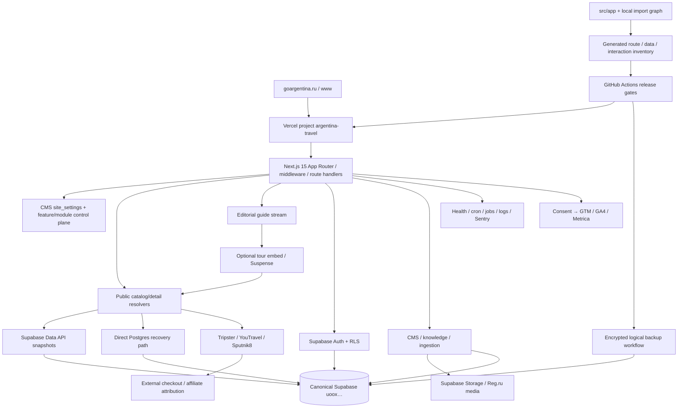

# DEPENDENCY_GRAPH

Обновлён по repository + production/candidate evidence 2026-07-29.

## Critical user flow

`browser → page/RSC → resolver → snapshot/partner → typed mapper → catalog/detail → capability-driven CTA → partner outbound or internal persisted request`.

Current production boundary is broken: Supabase REST and deployed direct PG are unavailable. Candidate WP-001 preserves this as `unavailable` and does not alter checkout URLs or create external orders. Candidate WP-002 makes the next action and seller boundary explicit in public copy.

## Release dependency chain

`frozen source SHA → npm ci → type/lint/unit/contracts → build → migration dry-run/parity → preview deployment ID → browser/e2e/smoke → promote same artifact → production SHA/ID → health/catalog/detail/analytics evidence`.

Current breaks: exact SHA `91be7962` is built as deployment `6Y9E1pGV4DD85N5U9JzqztLadTEc` and immutable browser evidence exists, but migration parity and Vercel runtime-log scope are unavailable; preview and production data-plane health are down. The deployment proves the generated-inventory packet and fail-closed behavior, not production readiness.

## Data ownership boundaries

- GoArgentina production database is canonical ref `uooxrypocahomoqzdvzy`; other accessible Supabase projects are not evidence.
- Partner APIs own partner booking/payment; GoArgentina owns disclosure, attribution and safe redirect.
- Internal requests require persisted state, notifications, SLA and admin ownership before public promise.
- No B2B product may share production DB/secrets/releases without ADR.
- Current source topology is recorded in `docs/audit/architecture-current.md`; its data/access candidates remain static evidence until live Supabase and effect tests confirm them.
