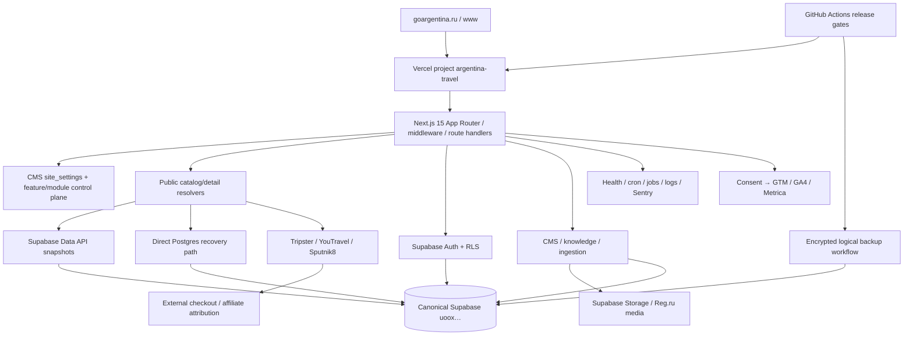

# DEPENDENCY_GRAPH

Обновлён по repository + production baseline 2026-07-28.

## Critical user flow

`browser → page/RSC → resolver → snapshot/partner → typed mapper → catalog/detail → capability-driven CTA → partner outbound or internal persisted request`.

Current broken boundary: both Supabase REST and direct PG are unavailable. Partner/list repositories historically collapse failure to `[]/null`, allowing `200 empty` or false `404`. WP-001 changes this boundary; it must not alter checkout URLs or create external orders.

## Release dependency chain

`frozen source SHA → npm ci → type/lint/unit/contracts → build → migration dry-run/parity → preview deployment ID → browser/e2e/smoke → promote same artifact → production SHA/ID → health/catalog/detail/analytics evidence`.

Current breaks: source not frozen; migration parity unavailable; Vercel deployment scope unavailable; production health down.

## Data ownership boundaries

- GoArgentina production database is canonical ref `uooxrypocahomoqzdvzy`; other accessible Supabase projects are not evidence.
- Partner APIs own partner booking/payment; GoArgentina owns disclosure, attribution and safe redirect.
- Internal requests require persisted state, notifications, SLA and admin ownership before public promise.
- No B2B product may share production DB/secrets/releases without ADR.
