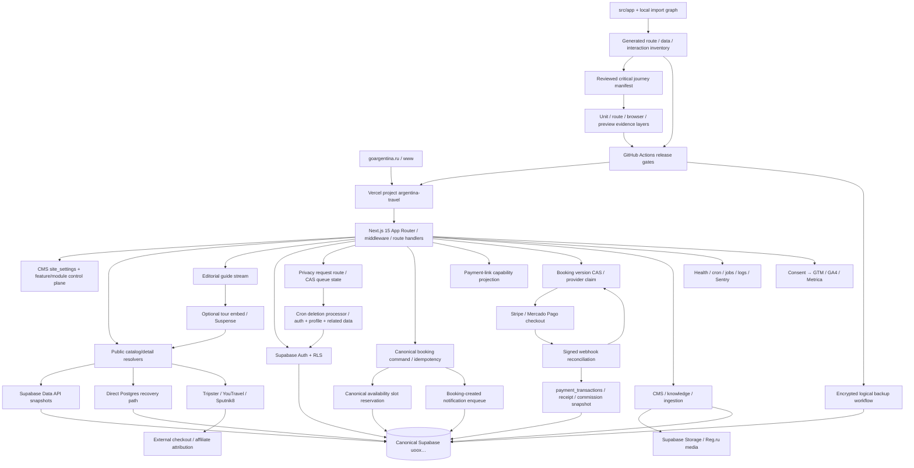

# DEPENDENCY_GRAPH

Обновлён по repository + production/candidate evidence 2026-07-29.

## Critical user flow

`browser → page/RSC → resolver → snapshot/partner → typed mapper → catalog/detail → capability-driven CTA → partner outbound or internal persisted request`.

Current production boundary is broken: Supabase REST and deployed direct PG are unavailable. Candidate WP-001 preserves this as `unavailable` and does not alter checkout URLs or create external orders. Candidate WP-002 makes the next action and seller boundary explicit in public copy.

## Release dependency chain

`frozen source SHA → npm ci → type/lint/unit/contracts → build → migration dry-run/parity → preview deployment ID → browser/e2e/smoke → promote same artifact → production SHA/ID → health/catalog/detail/analytics evidence`.

Current breaks: latest WP-011 exact SHA `84988cf` is immutable deployment `8aKBjCN2veH3BPrjgcpooPVnn7k8` with exact local build, route, candidate-integrity journey and local/remote desktop/mobile browser evidence. WP-010 remains immutable deployment `4aRm8X7QNDMLPXcoTgZseo64KrSK`. Neither packet proves live booking/payment persistence: migration parity and runtime-log scope are unavailable, while preview and production data-plane health are down.

## Data ownership boundaries

- GoArgentina production database is canonical ref `uooxrypocahomoqzdvzy`; other accessible Supabase projects are not evidence.
- Partner APIs own partner booking/payment; GoArgentina owns disclosure, attribution and safe redirect.
- Internal requests require persisted state, notifications, SLA and admin ownership before public promise.
- No B2B product may share production DB/secrets/releases without ADR.
- Current source topology is recorded in `docs/audit/architecture-current.md`; its data/access candidates remain static evidence until live Supabase and effect tests confirm them.
- Critical action topology is recorded in `docs/audit/critical-interaction-evidence.csv`; `contract_tested` means only the listed unit contract, while route/browser/preview/live gaps remain explicit.
- Privacy approval owns only the CAS queue transition; the cron processor owns irreversible deletion/anonymization. WP-008 preserves retry identity; WP-009 makes terminal writes monotonic and isolates notification failure. Candidate evidence still does not prove live cron completion, unique active requests, leases/checkpoints or transactional audit.
- A payment-link token owns only the bounded checkout/status view. The first online provider is claimed on the booking row before external checkout creation; signed provider webhooks remain the only authority for captured payment state.
- A native booking request owns only canonical server-derived commercial fields. Quote intent never owns inventory; a scheduled booking must confirm its canonical availability slot before the atomic persistence command. Notification enqueue follows only a newly created booking, not an idempotent replay.
