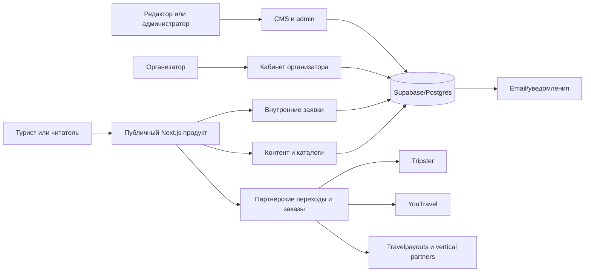

# Архитектура продукта и информационная архитектура

Дата: 2026-07-15
Статус: описание фактической системы и целевых границ release candidate; без изменений product code.

## 1. Системный контекст

GoArgentina — гибридная контентно-коммерческая платформа. Она одновременно выступает:

- издателем проверяемого контента об Аргентине;
- каталогом географии, мест, маршрутов, туров и экскурсий;
- владельцем внутренних заявок по собственным предложениям;
- витриной и проводником к внешним партнёрам;
- рабочим пространством туриста, организатора, редактора и администратора.



Главная архитектурная граница проходит не между страницами, а между владельцем исполнения:

- **GoArgentina-owned**: контент, поиск, аккаунт, избранное, внутренние заявки, кабинеты, модерация, CRM-состояния.
- **Organizer-owned**: содержание собственного тура, подтверждение, условия отмены и часть коммуникации.
- **Partner-owned**: внешняя доступность, финальная цена, checkout, оплата, отмена и поддержка по партнёрской покупке.

## 2. Технологический контур

| Слой | Фактическая роль | Источник истины | Деградация |
|---|---|---|---|
| Next.js 15 / React 19 | SSR/RSC, страницы, API routes, кабинеты | Репозиторий | Error boundaries, static/seed fallback в отдельных доменах |
| Supabase Auth | Регистрация, сессии, reset password, роли | Supabase Auth + profile/role data | Гостевые tokenized сценарии для заявок, но не подмена аккаунта |
| Supabase/Postgres | Контент, заявки, настройки, CRM, moderation | База production | Консервативный empty/error; fallback только там, где явно предусмотрен |
| Prisma | Типизированная модель/миграционный контекст части БД | `prisma/schema.prisma` + migrations | Нельзя считать одной только Prisma-схемой всю live-схему |
| CMS layer | Documents, publication, translations, globals | CMS documents + `site_settings` | TS fallback остаётся для непереведённых lanes, особенно places |
| Partner adapters | Каталоги, цены, ссылки, booking handoff | API партнёра + cached/imported record | Affiliate deep link или честное unavailable state |
| Search | Meilisearch, затем Postgres/static fallback | Индекс + canonical entities | Fallback сохраняет полезный ответ, но маркируется в telemetry |
| Media resolver | Local/CMS/partner/Wikimedia assets | Canonical media metadata | Fallback image без битого `` |
| Analytics | Product events + consent gate | Event taxonomy/dataLayer | Необязательные скрипты не должны грузиться до согласия |

## 3. Доменные границы

### Discovery и география

Canonical hierarchy для развития:

```text
Country
└── Macroregion (туристическая география)
    └── Province (административная география, когда полезна)
        └── Destination (город, населённый пункт, маршрутный кластер)
            └── Place (конкретный POI)

Collection — редакционная тема, связывает любые Destination/Place/Tour/Article.
Itinerary — упорядоченный маршрут по Destination/Place.
CrossBorderDestination — отдельная сущность для поездок из Аргентины.
ExperienceType — фасет интереса, а не копия места.
```

Текущее приложение уже разделяет `/destinations`, `/places`, `/collections`, `/itineraries`, но часть данных и фильтров всё ещё опирается на неоднородные legacy-типы. Canonical object должен иметь один URL; множественная принадлежность оформляется relation, а не дубликатом записи.

### Commerce

Commerce состоит из двух разных агрегатов:

1. **Internal booking**: canonical tour → availability/price snapshot → booking → travelers → communication → payment metadata/status.
2. **Partner handoff**: imported offer → fresh partner facts → disclosure → attributed outbound/external order → partner-owned lifecycle.

Смешивать их в один общий «checkout» нельзя. Нормализованная capability из [capability-matrix.md](./capability-matrix.md) является контрактом между данными, UI, аналитикой и legal copy.

### Content и CMS

Поток публикации:

```text
draft → autosave → preview → moderation → published
                       ↘ changes_requested ↗
```

Blog, guide и destination имеют 100% CMS coverage и cutover. Places имеют 28% CMS coverage, поэтому TS fallback является текущей production-архитектурой, а не временной деталью, которую можно молча удалить.

### Identity и рабочие пространства

- Турист: профиль, заявки, избранное, сообщения, отзывы, подготовка поездки.
- Организатор: туры, заявки, сообщения, статьи, аналитика, настройки; финансы показывают только подтверждённые данные.
- Admin/editor: операции, marketplace, content, users, reports, system controls с server-side capability checks.

Role switch меняет рабочее пространство, но не должен дублировать аккаунт или разрывать историю пользователя.

## 4. Фактическая публичная IA

Текущий единый источник header/mobile navigation — `src/data/site-nav.ts`; CMS `site.navigation` управляет видимостью верхних разделов и тремя utility links.

### Верхний уровень сейчас

1. Регионы и места
2. Туры
3. Экскурсии
4. Путеводитель
5. Галерея
6. Иммиграция
7. База знаний
8. Магазин
9. Сервисы
10. Блог
11. О нас

Desktop показывает приоритетные пункты и переносит остальные в overflow; mobile использует полный drawer. Сервисные ссылки на авиабилеты, трансферы, eSIM, страховку, аренду авто и аудиогиды повторяются в footer strip mega-menu.

### Проблемы текущей IA

- Один уровень смешивает пользовательские задачи, форматы контента и служебные разделы.
- `Путеводитель`, `База знаний`, `Блог` и `Иммиграция` частично конкурируют как точки входа в знание.
- `Галерея` и `О нас` занимают тот же семантический уровень, что и планирование и покупка.
- `Сервисы` дублирует vertical links в mega-menu/footer.
- CMS не управляет составом колонок mega-menu и footer как полноценными сущностями.

## 5. Целевая IA release line

Без удаления маршрутов верхний уровень следует консолидировать вокруг задач:

| Раздел | Содержимое | Роль |
|---|---|---|
| Куда поехать | Регионы, направления, места, карта, подборки, маршруты | Discovery |
| Туры и экскурсии | Туры, экскурсии, персональный подбор, distinction own/partner | Compare/convert |
| Спланировать поездку | Авиабилеты, трансферы, авто, страховка, eSIM, аудиогиды, trip prep | Practical action |
| Гид по Аргентине | Путеводитель, база знаний, иммиграция, журнал, поиск | Trusted knowledge |
| Моя поездка | Избранное, заявки, заказы, сообщения, подготовка | Return journey; contextual for signed-in users |

`Галерея`, `Магазин`, `О проекте`, `Контакты`, legal и organizer acquisition остаются discoverable, но переходят в contextual/secondary navigation. Это уменьшает когнитивную нагрузку без удаления URL или SEO-сигналов.

### Навигационные правила

1. Desktop и mobile получают одну и ту же структуру и различаются только presentation.
2. В header не более пяти первичных задач; overflow не должен становиться складом несвязанных ссылок.
3. Поиск глобальный, но результаты сгруппированы по canonical type и показывают происхождение.
4. Breadcrumbs отражают canonical hierarchy, а не историю кликов.
5. Contextual nav внутри guide/immigration не конкурирует с глобальным header.
6. Footer отвечает за доверие, legal, поддержку и полную карту разделов; он не повторяет случайно всю mega-menu.
7. Любая внешняя ссылка маркируется до перехода.

## 6. Архитектура навигации как контента

Текущее `site.navigation` — безопасный первый слой, но целевая модель должна иметь versioned publication:

```text
NavigationSet
  locale
  surface: header | mobile | footer | utility
  status: draft | published
  version
  items[]
    label
    href
    external
    capabilityGate
    featureFlag
    audience
    children[]
```

Перед публикацией нужны автоматические проверки: внутренний URL существует, external URL разрешён, нет дублей, глубина допустима, label локализован, feature/capability действительно включена. Preview должен показывать desktop и mobile из одной версии. Rollback — переключение на предыдущую опубликованную версию, а не ручное восстановление JSON.

## 7. Контракты данных и truth hierarchy

При конфликте источников действует порядок:

1. Live internal booking/payment state в БД.
2. Свежий ответ partner API для цены, доступности и статуса партнёрского заказа.
3. Canonical CMS content с provenance и review date.
4. Импортированный partner snapshot с `syncedAt` и stale policy.
5. Versioned repository fallback.

Нижний источник не должен перезаписывать более свежий. Listing и detail обязаны получать цену и capability через общий resolver, иначе появляются расхождения в CTA и обещаниях.

## 8. Надёжность и наблюдаемость

Для каждого внешнего adapter обязательны timeout, retry только для безопасных операций, idempotency для создания заказа, circuit-breaker/backoff, last-success timestamp и честный fallback. Для внутренних команд — idempotent command, server authorization, audit log и пользовательский результат, связанный с сохранённой записью.

Минимальные operational signals:

- sync freshness и число активных/stale/offline offers по партнёру;
- partner outbound → external order → known conversion;
- internal request started/completed/failed;
- notification queued/delivered/failed;
- payment webhook accepted/duplicate/rejected;
- search source, zero results и fallback rate;
- CMS publication, rollback и broken-link validation.

## 9. Решения и ограничения Agent 2

- Принята гибридная модель с жёстким capability-driven disclosure.
- Отклонена идея единого текста «бронирование и оплата на платформе» для всех карточек.
- Отклонено удаление работающих маршрутов ради чистой IA; сначала secondary placement, redirects только после evidence.
- CMS navigation признана частичной: visibility + utility links, не полный page-builder меню.
- Production-ready оплата не заявлена без подтверждённого provider checkout, webhook, reconciliation и refund.
- Product code в этой работе не изменялся.
